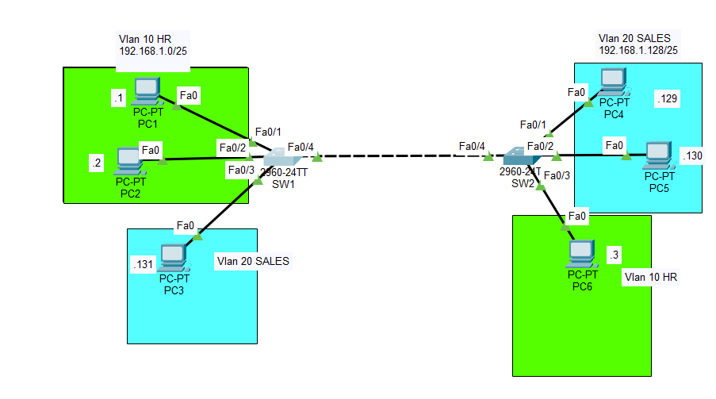
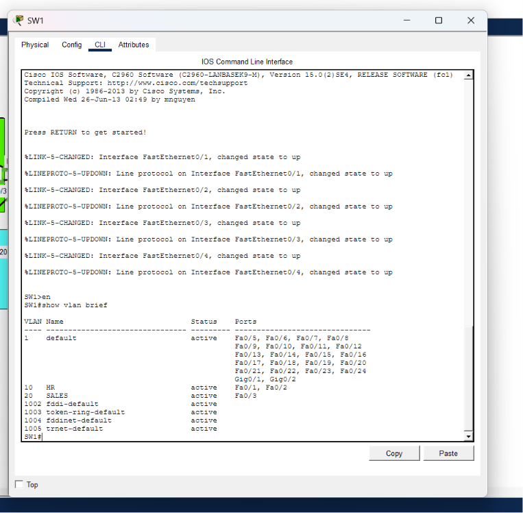
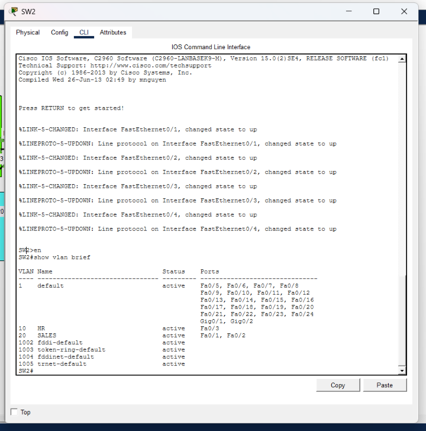
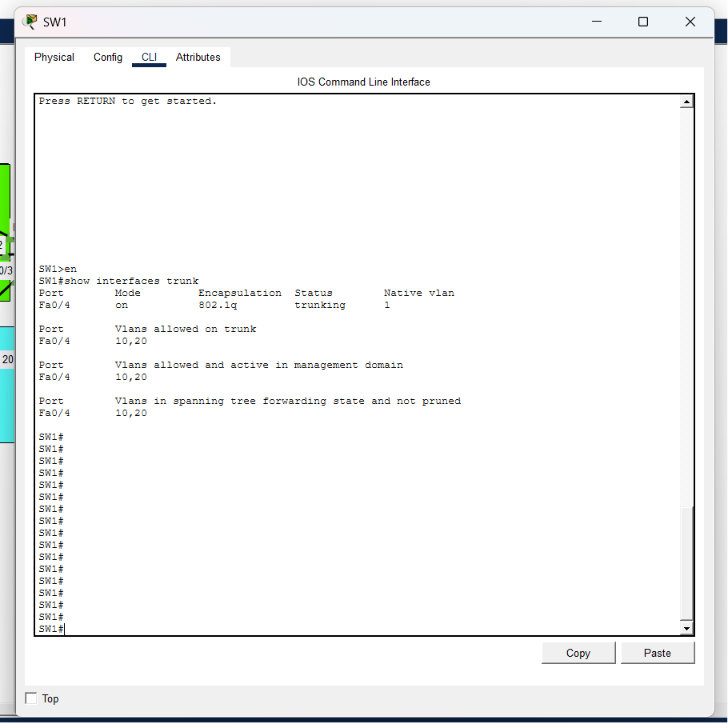
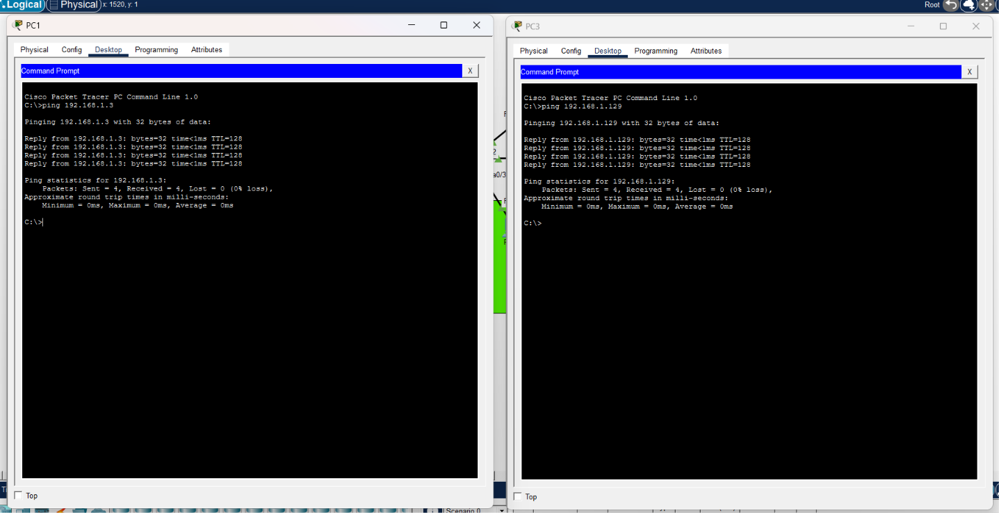
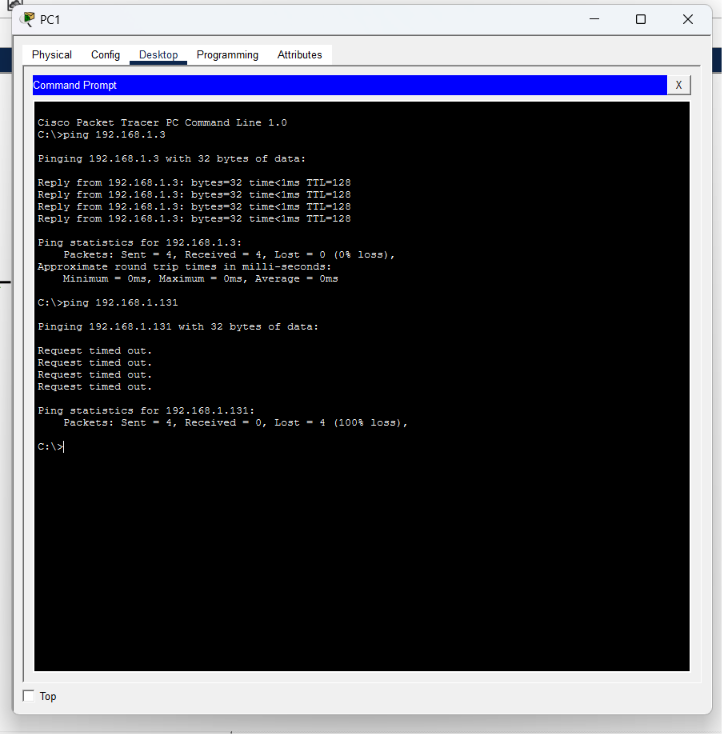

# Lab 1 — VLAN Segmentation and 802.1Q Trunking

## Overview

This lab demonstrates basic Layer 2 network segmentation using Cisco VLANs and an 802.1Q trunk between two Cisco switches.

The network separates users into two departments:

- **VLAN 10 — HR**
- **VLAN 20 — SALES**

The lab verifies that hosts within the same VLAN can communicate across the inter-switch trunk, while hosts in different VLANs remain isolated because no Layer 3 routing is configured.

## Objectives

- Create and name VLANs on two Cisco switches.
- Assign access ports to the correct VLANs.
- Configure an 802.1Q trunk between the switches.
- Verify VLAN membership and trunk operation.
- Test connectivity within the same VLAN.
- Confirm that different VLANs cannot communicate without Layer 3 routing.

## Topology



The topology uses two Cisco 2960 switches connected through an inter-switch trunk.

- **SW1:** HR and Sales access ports
- **SW2:** HR and Sales access ports
- **SW1 Fa0/4 ↔ SW2 Fa0/4:** 802.1Q trunk
- Multiple end hosts are placed in each VLAN.

## VLAN and IP Addressing

| VLAN | Department | Network | Hosts |
|---:|---|---|---|
| 10 | HR | `192.168.1.0/25` | PC1, PC2, PC6 |
| 20 | SALES | `192.168.1.128/25` | PC3, PC4, PC5 |

### Host addressing

| Device | VLAN | IP Address |
|---|---:|---|
| PC1 | 10 — HR | `192.168.1.1/25` |
| PC2 | 10 — HR | `192.168.1.2/25` |
| PC6 | 10 — HR | `192.168.1.3/25` |
| PC4 | 20 — SALES | `192.168.1.129/25` |
| PC5 | 20 — SALES | `192.168.1.130/25` |
| PC3 | 20 — SALES | `192.168.1.131/25` |

No default gateway is required for the main connectivity tests because this lab does not include Layer 3 routing.

## Switch Port Assignments

### SW1

| Interface | Device | VLAN |
|---|---|---:|
| Fa0/1 | PC1 | 10 — HR |
| Fa0/2 | PC2 | 10 — HR |
| Fa0/3 | PC3 | 20 — SALES |
| Fa0/4 | Uplink to SW2 | Trunk |

### SW2

| Interface | Device | VLAN |
|---|---|---:|
| Fa0/1 | PC4 | 20 — SALES |
| Fa0/2 | PC5 | 20 — SALES |
| Fa0/3 | PC6 | 10 — HR |
| Fa0/4 | Uplink to SW1 | Trunk |

## Configuration Summary

### VLAN creation

VLAN 10 and VLAN 20 were created on both switches and given department-specific names.

Example:

```cisco
vlan 10
 name HR

vlan 20
 name SALES
```

### Access-port assignment

HR hosts were assigned to VLAN 10 and Sales hosts were assigned to VLAN 20.

Example:

```cisco
interface fa0/1
 switchport mode access
 switchport access vlan 10
```

### Trunk configuration

The SW1–SW2 link was configured as an 802.1Q trunk so VLAN 10 and VLAN 20 could be carried between the switches.

Example:

```cisco
interface fa0/4
 switchport mode trunk
```

## Verification

### 1. Verify VLAN membership

Run on both switches:

```cisco
show vlan brief
```

This confirms:

- VLAN 10 exists and is named HR.
- VLAN 20 exists and is named SALES.
- The correct access ports are assigned to each VLAN.





### 2. Verify the trunk

Run on either switch:

```cisco
show interfaces trunk
```

This confirms that Fa0/4 is operating as a trunk and that the required VLANs are active across the trunk.



## Connectivity Testing

### Same-VLAN connectivity

Hosts in the same VLAN should be able to communicate even when they are connected to different switches.

Examples:

- **PC1 → PC6** — VLAN 10 to VLAN 10 — expected: **SUCCESS**
- **PC3 → PC4** — VLAN 20 to VLAN 20 — expected: **SUCCESS**



### Different-VLAN connectivity

Hosts in different VLANs should not communicate in this Layer 2-only design because no router or Layer 3 switch is present.

Example:

- **PC1 → PC3** — VLAN 10 to VLAN 20 — expected: **FAIL**



## Expected Results

| Test | Expected Result |
|---|---|
| HR host → HR host | ✅ Successful |
| SALES host → SALES host | ✅ Successful |
| HR host → SALES host | ❌ Blocked |
| SALES host → HR host | ❌ Blocked |

## Key Takeaways

This lab reinforced the following networking concepts:

- VLAN creation and naming
- Access-port configuration
- VLAN membership
- 802.1Q trunking
- VLANs extending across multiple switches
- Layer 2 broadcast-domain segmentation
- Basic Cisco IOS verification commands
- Connectivity testing and troubleshooting

## Tools

- Cisco Packet Tracer
- Cisco IOS
- Cisco 2960 switches

## Project File

The completed Packet Tracer lab is included in this repository:

`vlan-segmentation-trunking.pkt`
