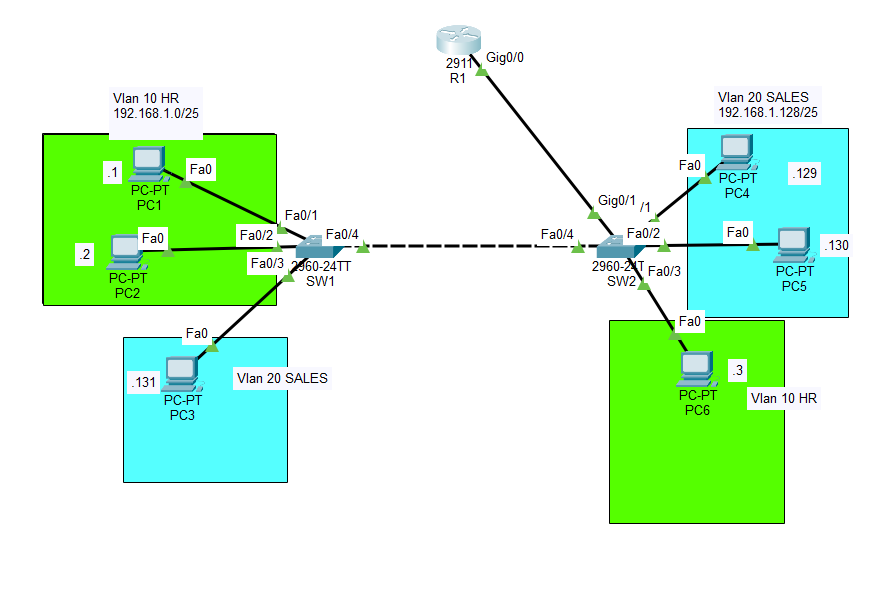
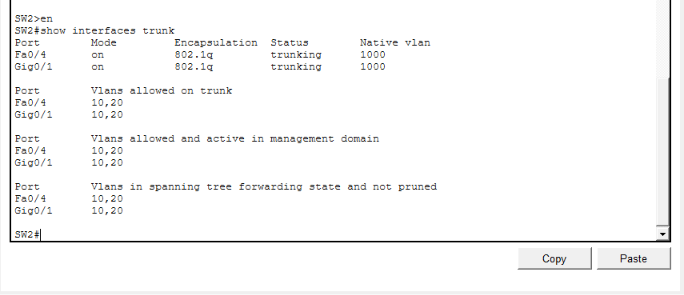
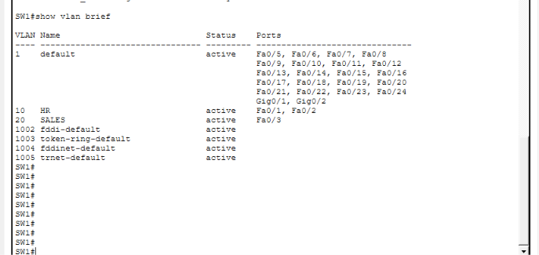
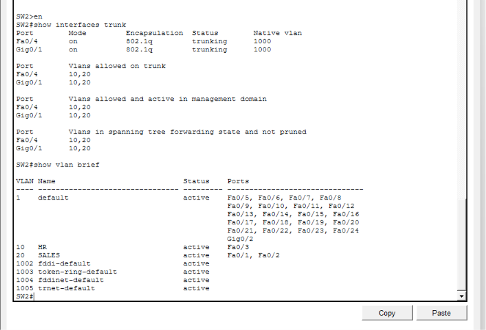
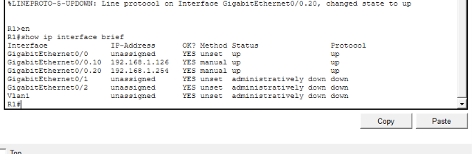
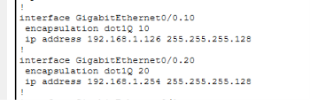
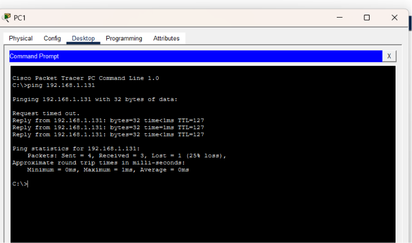

# Lab 2 — Inter-VLAN Routing with Router-on-a-Stick

## Overview

This lab builds on the VLAN segmentation topology from Lab 1 by introducing a Cisco 2911 router to provide Layer 3 communication between VLANs.

The network separates users into two departments:

- **VLAN 10 — HR**
- **VLAN 20 — SALES**

A router-on-a-stick design is used so that a single physical router interface can provide separate Layer 3 gateways for both VLANs. The inter-switch trunk continues to carry VLAN 10 and VLAN 20 between the switches.

The lab verifies that hosts in different VLANs can communicate through the router after inter-VLAN routing is configured.

## Objectives

- Configure VLAN 10 and VLAN 20 across two Cisco switches.
- Maintain 802.1Q trunk connectivity between the switches.
- Configure router-on-a-stick using Cisco 2911 subinterfaces.
- Assign Layer 3 gateway addresses to each VLAN.
- Configure the switch-to-router link as a trunk.
- Configure an unused native VLAN on the trunk.
- Verify router subinterface status and VLAN routing.
- Test end-to-end connectivity between different VLANs.

## Topology



The topology consists of:

- **R1:** Cisco 2911 router
- **SW1:** Cisco 2960 switch
- **SW2:** Cisco 2960 switch
- **VLAN 10:** HR
- **VLAN 20:** SALES
- An 802.1Q trunk between SW1 and SW2
- A router-on-a-stick trunk between R1 and the switch infrastructure

## VLAN and IP Addressing

| VLAN | Department | Network | Hosts |
|---:|---|---|---|
| 10 | HR | `192.168.1.0/25` | PC1, PC2, PC6 |
| 20 | SALES | `192.168.1.128/25` | PC3, PC4, PC5 |

### Host addressing

| Device | VLAN | IP Address |
|---|---:|---|
| PC1 | 10 — HR | `192.168.1.1/25` |
| PC2 | 10 — HR | `192.168.1.2/25` |
| PC6 | 10 — HR | `192.168.1.3/25` |
| PC4 | 20 — SALES | `192.168.1.129/25` |
| PC5 | 20 — SALES | `192.168.1.130/25` |
| PC3 | 20 — SALES | `192.168.1.131/25` |

### Router gateways

The router provides the default gateway for each VLAN using subinterfaces.

| VLAN | Router Subinterface | Gateway |
|---:|---|---|
| 10 | `G0/0.10` | `192.168.1.126/25` |
| 20 | `G0/0.20` | `192.168.1.254/25` |

## Router-on-a-Stick Configuration

The physical router interface is used as a trunk connection, with separate subinterfaces for each VLAN.

Example:

```cisco
interface GigabitEthernet0/0.10
 encapsulation dot1Q 10
 ip address 192.168.1.126 255.255.255.128

interface GigabitEthernet0/0.20
 encapsulation dot1Q 20
 ip address 192.168.1.254 255.255.255.128
```

Each subinterface acts as the Layer 3 gateway for its respective VLAN.

## Switching Configuration

### VLANs

VLAN 10 and VLAN 20 are configured on both switches:

```cisco
vlan 10
 name HR

vlan 20
 name SALES
```

Access ports are assigned according to the department of each connected host.

### Trunking

The inter-switch link carries both VLANs using 802.1Q trunking.

The router-facing link is also configured as a trunk so VLAN 10 and VLAN 20 can reach the appropriate router subinterfaces.

## Native VLAN Hardening

The trunk native VLAN was changed from the default VLAN 1 to an unused VLAN.

This provides a basic Layer 2 hardening measure by keeping normal user traffic separate from the native VLAN.

The native VLAN must be configured consistently on both ends of the relevant trunk.

Verification:

```cisco
show interfaces trunk
```



## Verification

### 1. Verify VLAN membership

Run on both switches:

```cisco
show vlan brief
```

This confirms that VLAN 10 and VLAN 20 exist and that the correct access ports are assigned.





### 2. Verify router interfaces

On R1:

```cisco
show ip interface brief
```

The router subinterfaces should be operational and have the expected IP addresses.



### 3. Verify router-on-a-stick configuration

The subinterface configuration should show the VLAN encapsulation and gateway addresses.

```cisco
show running-config
```



## Connectivity Testing

The main objective of this lab is to demonstrate communication between different VLANs through R1.

### Same-VLAN testing

Same-VLAN communication should continue to work:

- **PC1 → PC6:** VLAN 10 to VLAN 10 — **SUCCESS**
- **PC3 → PC4:** VLAN 20 to VLAN 20 — **SUCCESS**

### Inter-VLAN testing

A host in VLAN 10 should now be able to communicate with a host in VLAN 20 through R1.

Example:

```text
PC1 (192.168.1.1)
        |
      VLAN 10
        |
       R1
        |
      VLAN 20
        |
PC3 (192.168.1.131)
```

Example test:

```text
ping 192.168.1.131
```

Expected result: **Successful**

The reverse direction should also be tested:

```text
ping 192.168.1.1
```



## Before and After

### Lab 1 behavior

Without Layer 3 routing:

- HR → HR: ✅
- SALES → SALES: ✅
- HR → SALES: ❌
- SALES → HR: ❌

### Lab 2 behavior

With router-on-a-stick:

- HR → HR: ✅
- SALES → SALES: ✅
- HR → SALES: ✅
- SALES → HR: ✅

This demonstrates the role of a Layer 3 router in enabling communication between separate VLANs.

## Key Takeaways

This lab reinforced:

- VLAN segmentation
- 802.1Q trunking
- Router-on-a-stick
- Cisco router subinterfaces
- Inter-VLAN routing
- Default gateway configuration
- Native VLAN configuration
- Layer 2 and Layer 3 troubleshooting
- Verification using Cisco IOS commands

## Tools

- Cisco Packet Tracer
- Cisco IOS
- Cisco 2911 router
- Cisco 2960 switches

## Project File

The completed Packet Tracer project is included in this repository:

`inter-vlan-routing-router-on-a-stick.pkt`

