# Lab 3 — Single-Area OSPF Dynamic Routing

## Overview

This lab demonstrates dynamic routing using **Open Shortest Path First (OSPF)** in a single OSPF Area 0 environment.

The topology uses multiple Cisco routers connected through point-to-point networks, with separate LAN networks behind the routers. OSPF dynamically exchanges routes so devices on remote networks can communicate without manually configured static routes.

## Objectives

- Configure OSPF on multiple Cisco routers.
- Establish OSPF neighbor adjacencies.
- Use a single OSPF Area 0.
- Advertise LAN and transit networks through OSPF.
- Verify OSPF-learned routes.
- Test end-to-end connectivity across multiple routers.
- Use Cisco IOS commands to verify and troubleshoot OSPF.
- Observe routing behavior in a topology with multiple paths.

## Topology

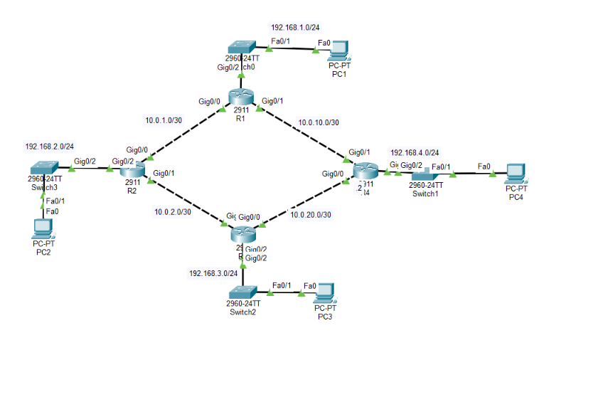

The topology consists of four Cisco routers connected through multiple point-to-point links. Each router also provides connectivity to a local LAN.

The multiple router-to-router paths allow OSPF to dynamically determine routes through the network.

## Network Addressing

### Point-to-Point Networks

| Link | Network |
|---|---|
| R1 ↔ R2 | `10.0.1.0/30` |
| R2 ↔ R3 | `10.0.2.0/30` |
| R3 ↔ R4 | `10.0.20.0/30` |
| R1 ↔ R4 | `10.0.10.0/30` |

### LAN Networks

| Router | Local Network |
|---|---|
| R1 | `192.168.1.0/24` |
| R2 | `192.168.2.0/24` |
| R3 | `192.168.3.0/24` |
| R4 | `192.168.4.0/24` |
### Loopback Interfaces

| Router | Loopback Address | Purpose |
|---|---|---|
| R1 | `1.1.1.1/32` | OSPF router ID / logical interface |
| R2 | `2.2.2.2/32` | OSPF router ID / logical interface |
| R3 | `3.3.3.3/32` | OSPF router ID / logical interface |
| R4 | `4.4.4.4/32` | OSPF router ID / logical interface |


## OSPF Design

This lab uses:

- **OSPF**
- **Single Area 0**
- OSPF process ID configured on the routers
- Point-to-point router links
- Dynamically advertised LAN and transit networks

Example configuration:

```cisco
router ospf 1
 router-id 1.1.1.1
 network 10.0.1.0 0.0.0.3 area 0
 network 10.0.10.0 0.0.0.3 area 0
 network 192.168.1.0 0.0.0.255 area 0
```

The exact network statements and router IDs should match the configuration used on each router.

## OSPF Router ID Selection

No explicit `router-id` command was configured.

Each router has a loopback interface with a unique /32 address. When an explicit OSPF router ID is not configured, OSPF can select the highest IP address on a loopback interface as the router ID.

In this lab, the loopback addresses provide deterministic router IDs:

| Router | Loopback | OSPF Router ID |
|---|---|---|
| R1 | `1.1.1.1` | `1.1.1.1` |
| R2 | `2.2.2.2` | `2.2.2.2` |
| R3 | `3.3.3.3` | `3.3.3.3` |
| R4 | `4.4.4.4` | `4.4.4.4` |

This demonstrates how loopback interfaces can be used to provide stable OSPF router IDs without manually configuring the `router-id` command.

> **Note:** OSPF selects its router ID when the OSPF process starts. If a loopback is added or changed after the process has already selected a router ID, the OSPF process may need to be restarted for the new router ID to be selected

## Verification

### 1. Verify OSPF Neighbor Adjacencies

Run:

```cisco
show ip ospf neighbor
```

This verifies that neighboring routers have successfully formed OSPF adjacencies.

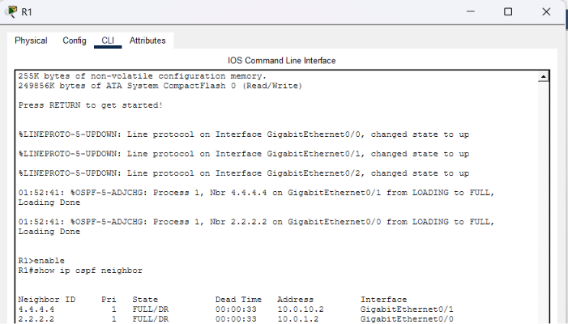

### 2. Verify OSPF Routes

Run:

```cisco
show ip route ospf
```

Routes learned dynamically through OSPF should appear with an `O` code in the routing table.

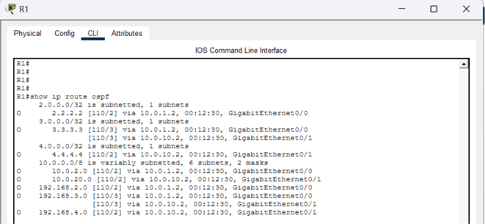

### 3. Verify OSPF Configuration

Run:

```cisco
show ip protocols
```

This helps verify that OSPF is active and that the expected networks are being advertised.

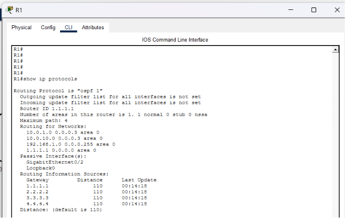

### 4. Verify OSPF-Enabled Interfaces

Run:

```cisco
show ip ospf interface brief
```

This verifies which interfaces are participating in OSPF.

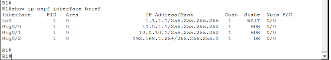

## Connectivity Testing

The main objective is to confirm that devices on remote networks can communicate through multiple OSPF routers.

Example:

```text
PC1
 ↓
R1
 ↓
R2 / R3
 ↓
R4
 ↓
Remote LAN
```

An end-to-end ping is used to verify connectivity between remote networks.

```text
ping <remote-host-ip>
```

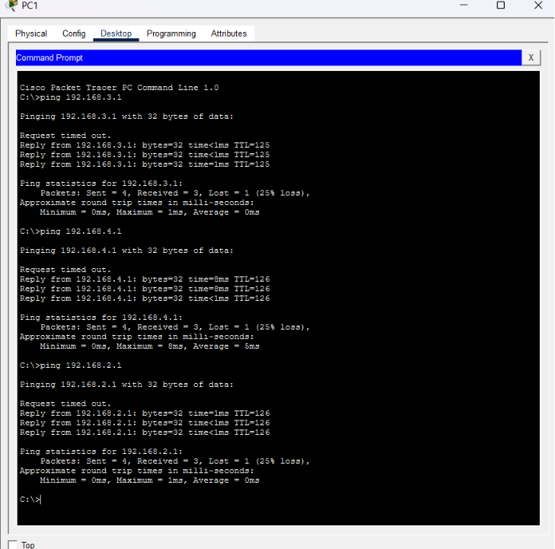

## Path Verification

Because the topology contains multiple paths, traceroute can be used to observe the path selected by the routing table. Here i traced the path taken by PC1 to PC3.

```text
traceroute 192.168.3.1
```

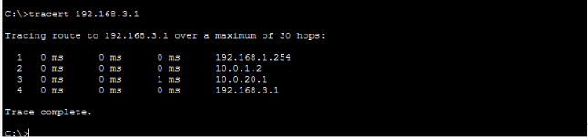


### Failure

```
R1(config)#int g0/1
R1(config-if)#shutdown
```
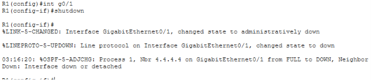

R1's routing table immediately reflects the loss:

| Destination | Before | After |
|---|---|---|
| `4.4.4.4/32`, `192.168.4.0/24` | `[110/2]` via 10.0.10.2 (direct) | `[110/4]` via 10.0.1.2 (via R2 → R3) |
| `3.3.3.3/32`, `192.168.3.0/24` | Two equal `[110/3]` paths (via R2 and via R4) | One `[110/3]` path only (via R2) |
| `2.2.2.2/32`, `192.168.2.0/24` | `[110/2]` via 10.0.1.2 | Unchanged — never used the failed link |

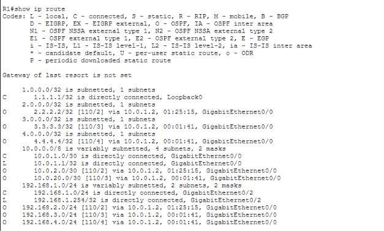

The middle row is the detail that matters most: R3's equal-cost pair collapses to a single path because one of its two contributing routes ran through the now-dead link — proof the ECMP wasn't a coincidence, it was genuinely built on two independent paths.

End-to-end traffic confirms it, not just the table:

```
traceroute 192.168.4.1
```
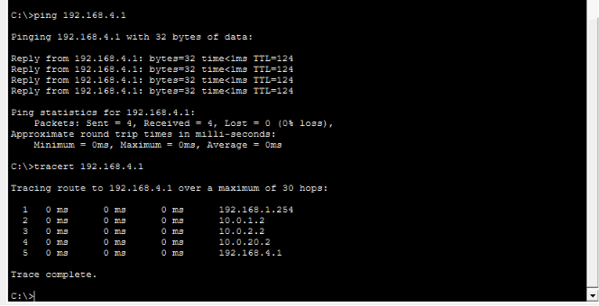

Traffic takes the long way around the ring — R1 → R2 → R3 → R4 — and still arrives with zero loss.

### Recovery

```
R1(config)#int g0/1
R1(config-if)#no shutdown
```
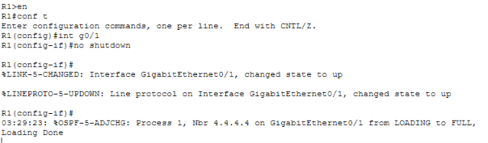

The routing table fully reconverges — including the ECMP pair for R3, which returns to two equal paths, not just one:

```
O  4.4.4.4/32 [110/2] via 10.0.10.2, GigabitEthernet0/1
O  3.3.3.3/32 [110/3] via 10.0.1.2, GigabitEthernet0/0
              [110/3] via 10.0.10.2, GigabitEthernet0/1
```
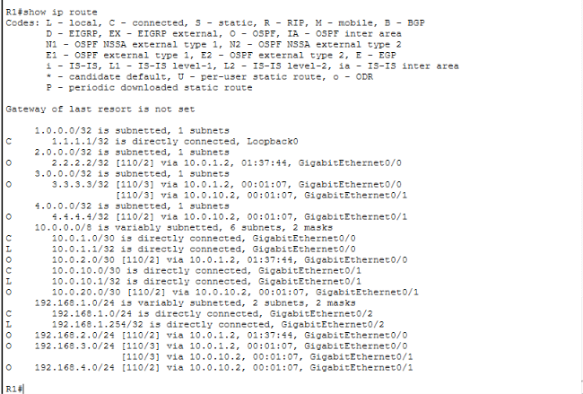


And traffic returns to the direct path:

```
traceroute 192.168.4.1
```
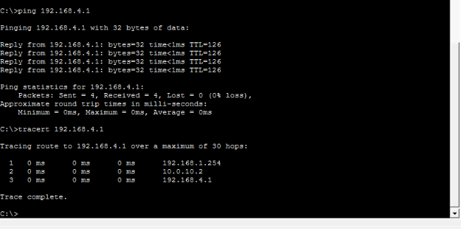


Three hops instead of five, straight through R4 again — the network fully healed itself with no manual routing changes anywhere

## Expected Results

| Verification | Expected Result |
|---|---|
| OSPF neighbor relationships | ✅ Established |
| Remote OSPF routes | ✅ Present in routing table |
| OSPF-enabled interfaces | ✅ Active |
| Remote LAN connectivity | ✅ Successful |
| Multi-hop routing | ✅ Successful |
| OSPF routes identified with `O` | ✅ Confirmed |


## Key Takeaways

This lab reinforced:

- Dynamic routing fundamentals
- OSPF neighbor formation
- OSPF Area 0
- Router IDs
- OSPF network advertisement
- OSPF-learned routes
- Point-to-point addressing using `/30` networks
- Loopback interfaces
- End-to-end routing verification


## Project File

The completed Packet Tracer project is included in this repository:

`ospf.pkt`
