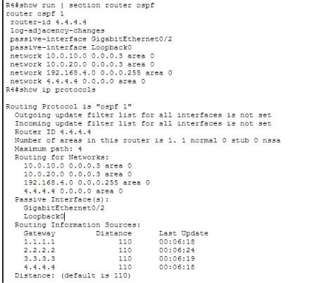
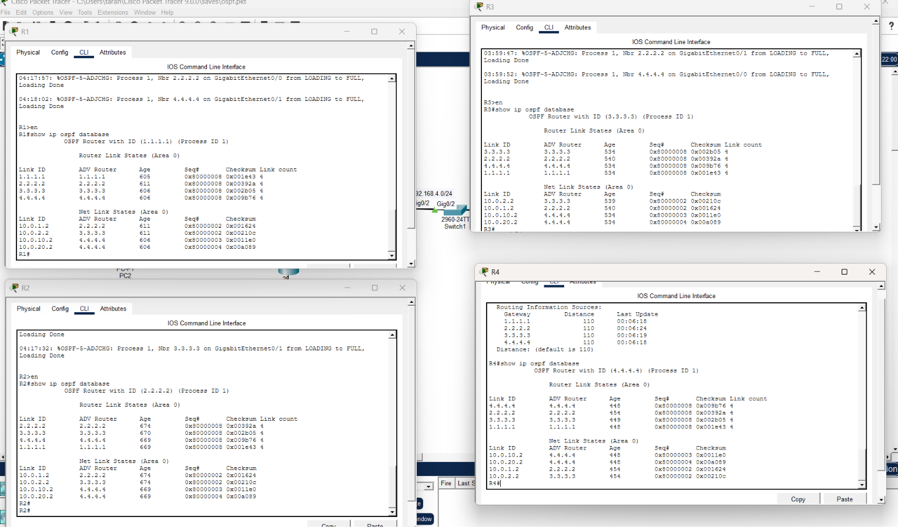

# Lab 3 — Single-Area OSPF with Redundant Paths and Failover Testing

Four Cisco routers in a ring running OSPF in a single Area 0, with equal-cost multipath between LANs and a full link-failure and recovery test.

The point of this lab is not just "OSPF works." It is that the network **reroutes around a dead link on its own**, keeps forwarding traffic the long way around the ring, and then reconverges back to the direct path when the link returns — with no manual routing changes anywhere.

---

## What This Lab Demonstrates

- OSPF neighbor adjacency formation across four routers in a single Area 0
- Loopback interfaces used to produce deterministic OSPF router IDs
- Equal-cost multipath (ECMP) arising naturally from a symmetric ring topology
- How the OSPF cost metric is calculated, and why the default reference bandwidth is a problem on Gigabit links
- Automatic reconvergence after a link failure, verified in the routing table *and* with live end-to-end traffic
- Full recovery — including the restoration of the ECMP pair — when the link is brought back

---

## Lab Environment

| Item | Value |
|---|---|
| Simulator | Cisco Packet Tracer <!-- TODO: version --> |
| Router model | <!-- TODO: e.g. ISR 2911 --> |
| Routers | 4 |
| End devices | 4 (one PC per LAN) |
| Routing protocol | OSPFv2, single area (Area 0) |

---

## Topology


The four routers form a **ring**: R1 → R2 → R3 → R4 → R1. Every router also serves a local LAN.

The ring is what makes this lab interesting. Because it is symmetric, R1 has two equal-cost paths to R3 (clockwise via R2, counter-clockwise via R4), and every router remains reachable if any single link fails. Both of those properties are tested below.

```text
        192.168.1.0/24            192.168.2.0/24
             │                          │
            [R1]────10.0.1.0/30────────[R2]
             │                          │
      10.0.10.0/30                10.0.2.0/30
             │                          │
            [R4]────10.0.20.0/30───────[R3]
             │                          │
        192.168.4.0/24            192.168.3.0/24
```

---

## Addressing

**Convention:** each router's LAN interface uses  `.254 ` and each PC uses `.1` in its own LAN. Point-to-point links use `/30` subnets, with the lower-numbered router taking `.1` and its neighbor taking `.2`.

### Point-to-Point Links

| Link | Network | R‑side IP | Neighbour IP |
|---|---|---|---|
| R1 ↔ R2 | `10.0.1.0/30` | R1: `10.0.1.1` | R2: `10.0.1.2` |
| R2 ↔ R3 | `10.0.2.0/30` | R2: `10.0.2.1` | R3: `10.0.2.2` |
| R3 ↔ R4 | `10.0.20.0/30` | R3: `10.0.20.1` | R4: `10.0.20.2` |
| R1 ↔ R4 | `10.0.10.0/30` | R4: `10.0.10.2` | R1: `10.0.10.1` |

### Interface Assignments

| Router | Interface | IP Address | Connects To |
|---|---|---|---|
| R1 | Gi0/0 | `10.0.1.1/30` | R2 |
| R1 | Gi0/1 | `10.0.10.1/30` | R4 |
| R1 | Gi0/2 | `192.168.1.254/24` | LAN 1 |
| R1 | Lo0 | `1.1.1.1/32` | — |
| R2 | Gi0/0 | `10.0.1.2/30` | R1 |
| R2 | Gi0/1 | `10.0.2.1/30` | R3 |
| R2 | Gi0/2 | `192.168.2.254/24` | LAN 2 |
| R2 | Lo0 | `2.2.2.2/32` | — |
| R3 | Gi0/1 | `10.0.2.2/30` | R2 |
| R3 | Gi0/0 | `10.0.20.1/30` | R4 |
| R3 | Gi0/2 | `192.168.3.254/24` | LAN 3 |
| R3 | Lo0 | `3.3.3.3/32` | — |
| R4 | Gi0/0 | `10.0.20.2/30` | R3 |
| R4 | Gi0/1 | `10.0.10.2/30` | R1 |
| R4 | Gi0/2| `192.168.4.254/24` | LAN 4 |
| R4 | Lo0 | `4.4.4.4/32` | — |

### End Devices

| Host | IP Address | Default Gateway |
|---|---|---|
| PC1 | `192.168.1.1/24` |192.168.1.254 |
| PC2 | `192.168.2.1/24` |192.168.2.254 |
| PC3 | `192.168.3.1/24` |192.168.3.254 |
| PC4 | `192.168.4.1/24` |192.168.4.254 |

---

## OSPF Configuration

Single OSPF process, single Area 0, on all four routers. Each router advertises its two transit links, its LAN, and its loopback.


### R1

```cisco
interface Loopback0
 ip address 1.1.1.1 255.255.255.255
!
router ospf 1
 network 10.0.1.0 0.0.0.3 area 0
 network 10.0.10.0 0.0.0.3 area 0
 network 192.168.1.0 0.0.0.255 area 0
 network 1.1.1.1 0.0.0.0 area 0
```
### R2

```cisco
interface Loopback0
 ip address 2.2.2.2 255.255.255.255
!
router ospf 1
 network 10.0.1.0 0.0.0.3 area 0
 network 10.0.2.0 0.0.0.3 area 0
 network 192.168.2.0 0.0.0.255 area 0
 network 2.2.2.2 0.0.0.0 area 0
```
### R3

```cisco
interface Loopback0
 ip address 3.3.3.3 255.255.255.255
!
router ospf 1
 network 10.0.2.0 0.0.0.3 area 0
 network 10.0.20.0 0.0.0.3 area 0
 network 192.168.3.0 0.0.0.255 area 0
 network 3.3.3.3 0.0.0.0 area 0
```
### R4
```cisco
interface Loopback0
 ip address 4.4.4.4 255.255.255.255
!
router ospf 1
 router-id 4.4.4.4
 network 10.0.20.0 0.0.0.3 area 0
 network 10.0.10.0 0.0.0.3 area 0
 network 192.168.4.0 0.0.0.255 area 0
 network 4.4.4.4 0.0.0.0 area 0
```


Note the asymmetry: R1, R2 and R3 have **no `router-id` command**, while R4 has one configured explicitly. That difference is intentional and is explained in the next section.

---

## Router ID Selection

OSPF picks its router ID in this order:

1. An explicitly configured `router-id` value
2. The highest IP address on any active loopback interface
3. The highest IP address on any active physical interface

This topology exercises **both** of the first two rules.

R1, R2 and R3 have no `router-id` configured, so each falls through to rule 2 and elects its loopback. R4 has the ID set explicitly with `router-id 4.4.4.4`. Every router ends up with a predictable ID, but by two different mechanisms:

| Router | Loopback | OSPF Router ID | Selected By |
|---|---|---|---|
| R1 | `1.1.1.1` | `1.1.1.1` | Highest loopback (rule 2) |
| R2 | `2.2.2.2` | `2.2.2.2` | Highest loopback (rule 2) |
| R3 | `3.3.3.3` | `3.3.3.3` | Highest loopback (rule 2) |
| R4 | `4.4.4.4` | `4.4.4.4` | Explicit `router-id` (rule 1) |

The two methods land on the same value on R4, which is exactly why nothing in the neighbor or route output reveals the difference — you have to look at the configuration to see it.

```cisco
R4# show run | section router ospf
R4# show ip protocols
```



**Why configure it explicitly at all?** OSPF selects its router ID once, when the process starts, and then keeps it. If a loopback is added or renumbered after the process is already running, the ID does not update until the process is cleared:

```cisco
R4# clear ip ospf process
```

An explicit `router-id` sidesteps that ordering problem entirely — the ID is whatever you declared it to be, regardless of what interfaces exist or when they appeared. That predictability is why production designs generally set it explicitly rather than relying on the election, even when a loopback is present.

The loopback still earns its place either way: without one, a router with no explicit ID falls through to rule 3 and picks whichever physical interface holds the highest address — an ID that can change when that interface goes down. A loopback never goes down.

---

## Understanding the OSPF Cost Metric

Every metric in the routing tables below follows from one formula:

```text
cost = reference bandwidth ÷ interface bandwidth   (minimum 1)
```

The default reference bandwidth is **100 Mbps**. Every interface in this topology is Gigabit Ethernet, and a loopback is treated as cost 1 as well — so **every single interface here costs exactly 1**. That makes the arithmetic easy to follow:

| Route from R1 | Path | Cost breakdown | Metric |
|---|---|---|---|
| `2.2.2.2/32` | R1 → R2 | 1 link + 1 loopback | `[110/2]` |
| `4.4.4.4/32` | R1 → R4 | 1 link + 1 loopback | `[110/2]` |
| `3.3.3.3/32` | R1 → R2 → R3 | 2 links + 1 loopback | `[110/3]` |
| `3.3.3.3/32` | R1 → R4 → R3 | 2 links + 1 loopback | `[110/3]` |

The last two rows are the same cost, which is exactly why R3's networks install as an **equal-cost multipath pair** rather than a single route. That is a property of the ring, not a coincidence.

### The problem with the default

Because the default reference bandwidth is 100 Mbps, *anything* at 100 Mbps or faster is rounded to cost 1. A 100 Mbps FastEthernet link and a 10 Gbps link would look identical to OSPF, and it would happily load-balance across both. In production the fix is to raise the reference bandwidth on **every** router in the domain — a mismatch causes inconsistent path selection:

```cisco
router ospf 1
 auto-cost reference-bandwidth 1000
```

This lab intentionally leaves the default in place so the cost arithmetic above stays readable.

---

## Verification

### 1. Neighbor Adjacencies

```cisco
show ip ospf neighbor
```

Confirms each router has formed a FULL adjacency with both of its ring neighbours.


### 2. Link-State Database

```cisco
show ip ospf database
```

All four routers hold an **identical** database of four Type-1 (Router) LSAs — one per router in Area 0. This is the defining difference between a link-state protocol and a distance-vector one: every router builds its own map of the topology and runs SPF against it, rather than trusting a neighbour's summary of the world.

 

### 3. OSPF-Learned Routes

```cisco
show ip route ospf
```

Dynamically learned routes appear with the `O` code and an administrative distance of 110.


s
### 4. Protocol Configuration

```cisco
show ip protocols
```

Confirms OSPF is running, shows the router ID it selected, and lists the networks being advertised.


### 5. Participating Interfaces

```cisco
show ip ospf interface brief
```

Confirms which interfaces are enabled for OSPF, and their cost and neighbour count.


---

## Connectivity Testing

End-to-end reachability across the ring, from a PC on one LAN to a PC three routers away:

```text
PC1 → R1 → R4 → PC4
```

```cisco
ping 192.168.4.1
```


### Path Verification

With two viable paths through the ring, `traceroute` shows which one the routing table actually chose:

```cisco
traceroute 192.168.3.1
```


---

## Failure Test — Shutting the R1 ↔ R4 Link

```cisco
R1(config)# interface GigabitEthernet0/1
R1(config-if)# shutdown
```


R1's routing table reflects the loss immediately:

| Destination | Before | After |
|---|---|---|
| `4.4.4.4/32`, `192.168.4.0/24` | `[110/2]` via `10.0.10.2` (direct) | `[110/4]` via `10.0.1.2` (R2 → R3 → R4) |
| `3.3.3.3/32`, `192.168.3.0/24` | Two equal `[110/3]` paths (via R2 and via R4) | One `[110/3]` path (via R2 only) |
| `2.2.2.2/32`, `192.168.2.0/24` | `[110/2]` via `10.0.1.2` | Unchanged — never used the failed link |


The middle row is the one that matters. R3's equal-cost pair collapses to a single entry because one of the two contributing paths ran through the now-dead link. That is direct evidence the ECMP was real — two genuinely independent paths, not a display artifact.

The cost change on row one is also worth reading: `[110/2]` → `[110/4]` is exactly the two extra hops the traffic now takes.

### Traffic confirms it

A routing table is a claim. Traffic is proof:

```cisco
traceroute 192.168.4.1
```


Traffic takes the long way around the ring — R1 → R2 → R3 → R4 — and arrives with zero loss.

### How fast was that, really?

The reconvergence here looked instantaneous, and it was — but only because `shutdown` takes the line protocol down. The interface-down event is detected in hardware and immediately triggers an LSA flood, so SPF reruns within milliseconds.

A **soft failure** behaves very differently. If the physical link stays up but the neighbour stops responding (a failed remote device, a provider fault mid-path, a misconfiguration), OSPF has no interface event to react to. It has to wait for the **dead interval** to expire — 40 seconds by default, with hellos every 10 seconds — before it declares the neighbour down and reconverges.

That gap is why production designs tune the timers or run BFD:

```cisco
interface GigabitEthernet0/1
 ip ospf hello-interval 3
 ip ospf dead-interval 9
```


---

## Recovery

```cisco
R1(config)# interface GigabitEthernet0/1
R1(config-if)# no shutdown
```


The routing table fully reconverges — including the ECMP pair for R3, which returns to two equal paths rather than staying at one:

```text
O  4.4.4.4/32 [110/2] via 10.0.10.2, GigabitEthernet0/1
O  3.3.3.3/32 [110/3] via 10.0.1.2, GigabitEthernet0/0
              [110/3] via 10.0.10.2, GigabitEthernet0/1
```


And traffic returns to the direct path:

```cisco
traceroute 192.168.4.1
```


Three hops instead of five, straight through R4 again. The network healed itself in both directions with no manual routing changes anywhere.

---

## Production Considerations

This lab runs OSPF at its defaults so the behaviour above is easy to trace. A production deployment of the same topology would add:

| Change | Why |
|---|---|
| `ip ospf network point-to-point` on each `/30` | Ethernet is treated as a broadcast network by default, so IOS runs a DR/BDR election on links that can only ever hold two routers. Point-to-point skips the election and forms adjacencies faster. |
| OSPF authentication (MD5 or SHA) on transit links | Prevents a rogue router from injecting LSAs and poisoning the routing domain. |
| `auto-cost reference-bandwidth 1000` on every router | Lets OSPF distinguish between link speeds above 100 Mbps. Must be identical domain-wide. |
| Tuned hello/dead timers or BFD | Reduces soft-failure detection from ~40 s to sub-second. |


---

## Issues Encountered

### R4's router ID did not match its loopback

**What I saw.** `show ip ospf neighbor` on R1 and R3 listed their R4 neighbor with an ID from its Gi0/2 interface `192.168.4.254` instead of `4.4.4.4`. Nothing was broken — adjacencies were FULL and routing worked end to end — but R4's LSAs were identified by a LAN address while every other router in the database was identified by its loopback. In a four-router lab that is cosmetic; in a large area it makes the link-state database considerably harder to read, and router ID is also the tiebreaker in DR/BDR elections.

**Why it happened.** I started the OSPF process on R4 before configuring its loopback. With no `router-id` set and no loopback present, OSPF fell through to rule 3 of the selection order and elected the highest IP address on an active physical interface — the LAN interface. Because OSPF chooses the router ID once, at process start, and then holds it, adding the loopback afterwards had no effect at all.

**Fix.** Configure the loopback, set the ID explicitly, and restart the process so the new value is actually selected:

```cisco
R4(config)# interface Loopback0
R4(config-if)# ip address 4.4.4.4 255.255.255.255
R4(config-if)# exit
R4(config)# router ospf 1
R4(config-router)# router-id 4.4.4.4
R4(config-router)# end
R4# clear ip ospf process
```

`clear ip ospf process` is what makes the change take effect, and it is not a casual command — it tears down every adjacency on the router and rebuilds them from scratch. On a production device that is a brief outage, so it belongs in a maintenance window.

**What I'd do differently.** Configure loopbacks before starting the OSPF process, or set `router-id` explicitly from the beginning. Either one alone would have prevented this — the loopback plus a process clear would have produced the same `4.4.4.4` result without the explicit command. I kept the explicit `router-id` on R4 because it removes the dependency on interface configuration order entirely, which is why production designs tend to set it rather than rely on the election.

---

## Key Takeaways

- **Loopbacks give you deterministic router IDs.** Without them, OSPF picks whatever physical interface holds the highest address, and that ID can change when an interface flaps.
- **ECMP is a property of the topology, not a setting.** R1 load-balanced to R3 because the ring made both directions cost exactly 3 — and the pair collapsed the moment one contributing path disappeared.
- **The cost metric is fully explainable.** Every `[110/n]` in this lab decomposes into a count of interfaces, which also exposes the weakness of the 100 Mbps default reference bandwidth on Gigabit links.
- **Reconvergence speed depends on how the link fails.** An interface going down is detected instantly; a neighbour going silent on a live link costs a 40-second dead interval.
- **Verify with traffic, not just tables.** A routing table entry says what the router intends to do. A traceroute says what actually happened.

---

## Files

| File | Description |
|---|---|
| `ospf.pkt` | Completed Packet Tracer project |
| `screenshots/` | Verification and failover captures |
