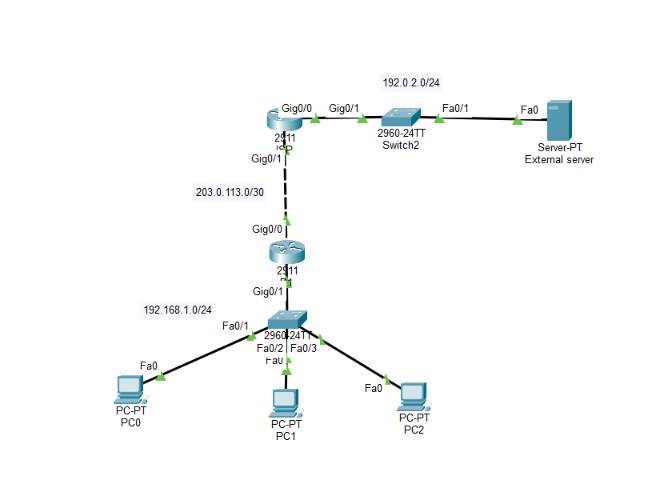
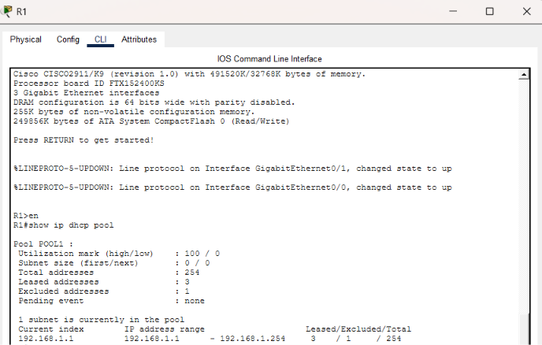
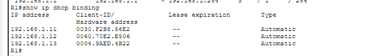
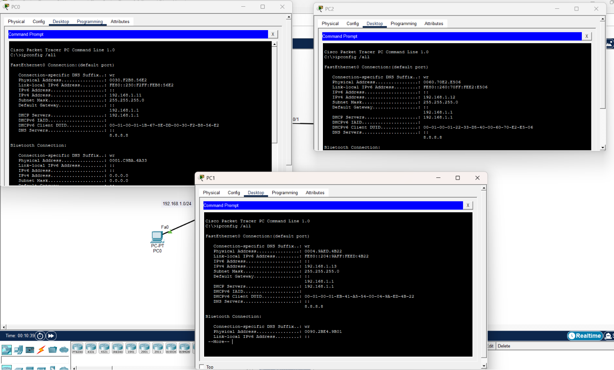
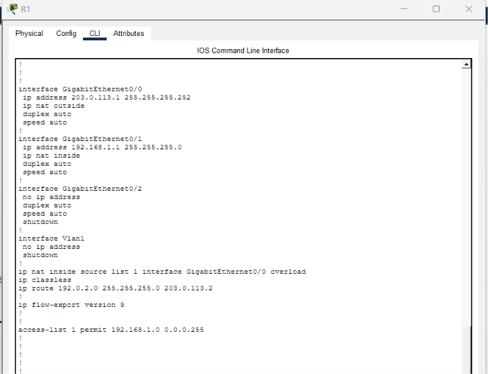
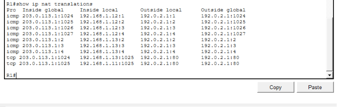
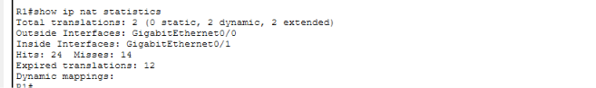

# Lab 4 — DHCP and NAT/PAT

## Overview

This lab demonstrates **DHCP** and **Port Address Translation (PAT)** working together in a small routed network.

R1 provides DHCP services to the internal LAN and performs PAT so multiple private hosts can share the R1 WAN address when communicating with an external network.

The lab also includes an ISP router and an external server network to demonstrate end-to-end connectivity.

## Objectives

- Configure R1 as a DHCP server for the internal LAN.
- Dynamically assign IPv4 addresses to internal clients.
- Reserve infrastructure addresses using DHCP exclusions.
- Configure NAT inside and outside interfaces.
- Configure PAT using an ACL and interface overload.
- Configure routing toward the external network.
- Verify DHCP leases and bindings.
- Verify PAT translations.
- Verify NAT statistics.

## Topology



### Network layout

```text
                    External Network
                      192.0.2.0/24
                           |
                        Switch2
                           |
                     ISP Router
                           |
                    203.0.113.0/30
                           |
                           R1
                 DHCP + NAT/PAT
                           |
                    192.168.1.0/24
                           |
                        Switch
                    /      |      \
                  PC0     PC1      PC2
```

R1 connects the internal `192.168.1.0/24` network to the external `192.0.2.0/24` network through the `203.0.113.0/30` WAN link.

## Addressing

### R1

| Interface | Address | Role |
|---|---|---|
| `GigabitEthernet0/0` | `203.0.113.1/30` | NAT outside / WAN |
| `GigabitEthernet0/1` | `192.168.1.1/24` | NAT inside / LAN |

### Internal LAN

| Network | Purpose |
|---|---|
| `192.168.1.0/24` | Internal client network |
| `192.168.1.1` | R1 default gateway |

R1 excludes:

```text
192.168.1.1 - 192.168.1.10
```

from the DHCP pool.

The DHCP clients shown in the lab received:

```text
192.168.1.11
192.168.1.12
192.168.1.13
```

### WAN Link

```text
R1:  203.0.113.1/30
ISP: 203.0.113.2/30
```

### External Network

```text
Network: 192.0.2.0/24
```

The R1 configuration includes a route to this network through the ISP:

```cisco
ip route 192.0.2.0 255.255.255.0 203.0.113.2
```

## Part 1 — DHCP Configuration

R1 is configured as the DHCP server for the internal LAN.

The DHCP configuration uses an excluded address range so that the router and other infrastructure addresses are not dynamically assigned to clients.

Example configuration:

```cisco
ip dhcp excluded-address 192.168.1.1 192.168.1.10

ip dhcp pool POOL1
 network 192.168.1.0 255.255.255.0
 default-router 192.168.1.1
 dns-server 8.8.8.8
```

### DHCP Pool Verification

```cisco
show ip dhcp pool
```

The verification output shows:

- Network: `192.168.1.0/24`
- Total addresses: `254`
- Excluded addresses: `1` as reported by Packet Tracer
- Active leases: `3`



### DHCP Binding Verification

```cisco
show ip dhcp binding
```

The lab produced DHCP bindings for three internal clients:

```text
192.168.1.11
192.168.1.12
192.168.1.13
```



### Client DHCP Configuration

The internal PCs are configured to obtain their IPv4 information dynamically using DHCP.



## Part 2 — NAT/PAT Configuration

R1 performs PAT for internal clients leaving through the WAN interface.

### NAT Interface Roles

The internal interface is configured as:

```cisco
interface GigabitEthernet0/1
 ip nat inside
```

The WAN interface is configured as:

```cisco
interface GigabitEthernet0/0
 ip nat outside
```

### NAT ACL

The internal `192.168.1.0/24` network is permitted for translation:

```cisco
access-list 1 permit 192.168.1.0 0.0.0.255
```

### PAT Overload

PAT is configured using the R1 outside interface address:

```cisco
ip nat inside source list 1 interface GigabitEthernet0/0 overload
```

This allows multiple internal clients to share the WAN address `203.0.113.1` while using different source port numbers.



## NAT/PAT Verification

### PAT Translations

After the internal clients generate traffic toward the external network, the active translations can be viewed with:

```cisco
show ip nat translations
```

The translation table demonstrates multiple internal addresses being translated through the same outside address:

```text
192.168.1.11  →  203.0.113.1
192.168.1.12  →  203.0.113.1
192.168.1.13  →  203.0.113.1
```

Different ICMP identifiers and TCP port numbers are used to keep the individual sessions separate.



### NAT Statistics

```cisco
show ip nat statistics
```

The captured output shows:

- Outside interface: `GigabitEthernet0/0`
- Inside interface: `GigabitEthernet0/1`
- Active translations present
- Dynamic translations in use

The lab recorded:

```text
Total translations: 2
Hits:                24
Misses:              14
Expired translations: 12
```

These counters provide evidence that NAT/PAT is actively processing traffic.



## Part 3 — End-to-End Connectivity

The objective of the lab is to allow internal DHCP clients to reach the external network.

The traffic path is:

```text
DHCP Client
    |
192.168.1.0/24
    |
   R1
 DHCP + PAT
    |
203.0.113.0/30
    |
  ISP Router
    |
192.0.2.0/24
    |
External Server
```

The successful traffic generated by the internal clients created the PAT entries shown in the NAT translation table.


## Verification Workflow

The complete verification process was:

```text
1. Configure R1 as DHCP server
          ↓
2. Configure internal PCs for DHCP
          ↓
3. Verify DHCP leases
          ↓
4. Mark R1 LAN/WAN interfaces as NAT inside/outside
          ↓
5. Configure NAT ACL
          ↓
6. Enable PAT overload
          ↓
7. Configure route to the external network
          ↓
8. Generate traffic from internal clients
          ↓
9. Verify PAT translations
          ↓
10. Verify NAT statistics
```

## Expected Results

| Test | Expected Result |
|---|---|
| Internal PCs obtain addresses via DHCP | ✅ Successful |
| DHCP bindings appear on R1 | ✅ Confirmed |
| R1 LAN interface operates as NAT inside | ✅ Confirmed |
| R1 WAN interface operates as NAT outside | ✅ Confirmed |
| Internal addresses are translated | ✅ Confirmed |
| Multiple clients share the outside address | ✅ Confirmed |
| NAT statistics show active translations | ✅ Confirmed |
| Internal clients reach the external network | ✅ Successful |


This lab reinforced:

- DHCP pool configuration
- DHCP address allocation
- DHCP lease verification
- DHCP exclusion ranges
- Default gateway and DNS assignment
- NAT inside and outside interface roles
- PAT overload
- NAT ACLs
- NAT translation verification
- NAT statistics and counters
- Static routing toward an external network
- End-to-end connectivity testing
- Basic DHCP and NAT/PAT troubleshooting


## Project File

The completed Packet Tracer project is included in this repository:

`dhcp-nat-pat.pkt`
