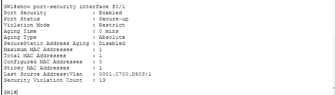

# Lab 5 — Layer 2 Security: Port Security, DHCP Snooping & DAI

## Overview

This lab demonstrates three Cisco Layer 2 security mechanisms on a small access network:

- **Port Security**
- **DHCP Snooping**
- **Dynamic ARP Inspection (DAI)**

The lab uses a Cisco 2960 switch connected to three legitimate client PCs and a Cisco 2911 router that provides DHCP services. A separate server is configured as a **rogue DHCP server** and connected to an untrusted switch port to demonstrate DHCP Snooping protection.

The main goal is to show how Layer 2 security controls can restrict unauthorized devices, identify trusted DHCP infrastructure, build DHCP Snooping bindings, and validate ARP information.

## Objectives

- Configure port security on client-facing access ports.
- Limit each access port to one secure MAC address.
- Use sticky MAC learning.
- Configure `restrict` mode for port-security violations.
- Configure DHCP Snooping for the client VLAN.
- Designate the legitimate DHCP path as trusted.
- Keep client-facing and rogue-server ports untrusted.
- Verify DHCP Snooping bindings.
- Simulate a rogue DHCP server.
- Configure and verify Dynamic ARP Inspection.
- Test legitimate connectivity after security controls are enabled.
- Use Cisco IOS verification commands to validate the configuration.

## Topology


### Network layout

```text
                         External Network
                           192.0.2.0/24
                                |
                           External SW
                                |
                         External Server
                                |
                           ISP Router
                                |
                         203.0.113.0/30
                                |
                               R1
                         Legitimate DHCP
                                |
                         192.168.1.0/24
                                |
                               SW1
                  Layer 2 Security Controls
                  /         |          |       \
               PC0         PC1        PC2   Rogue DHCP
                                                   Server
```

### Switch interface roles

| Switch Interface | Connected Device | Security Role |
|---|---|---|
| `Fa0/1` | PC0 | Client / Untrusted |
| `Fa0/2` | PC1 | Client / Untrusted |
| `Fa0/3` | PC2 | Client / Untrusted |
| `Fa0/4` | Rogue DHCP server | Untrusted |
| `Gi0/1` | R1 | Trusted DHCP path |

> Interface assignments should match the final Packet Tracer topology.

## Addressing

### Internal LAN

| Network / Device | Address |
|---|---|
| Internal LAN | `192.168.1.0/24` |
| R1 LAN gateway | `192.168.1.1/24` |

Legitimate DHCP clients received addresses in the range beginning at `192.168.1.11`.

The DHCP server on R1 excludes:

```text
192.168.1.1 - 192.168.1.10
```

### Rogue DHCP Server

The rogue server uses a static address so that it does not depend on its own DHCP service:

```text
IP address:       192.168.1.250
Subnet mask:      255.255.255.0
Default gateway:  192.168.1.1
```

The rogue DHCP service intentionally offers a different default gateway to clients:

```text
Rogue DHCP pool:
Network:          192.168.1.0/24
Starting address: 192.168.1.100
Default gateway:  192.168.1.254
DNS server:       8.8.8.8
```

The different gateway helps identify a rogue DHCP offer during the security test.

# Part 1 — Port Security

Port security is configured on the three client-facing switch ports.

The security policy is:

- Maximum secure MAC addresses: **1**
- Sticky MAC learning: **Enabled**
- Violation mode: **Restrict**

Example:

```cisco
interface FastEthernet0/1
 switchport mode access
 switchport port-security
 switchport port-security maximum 1
 switchport port-security mac-address sticky
 switchport port-security violation restrict
```

The same policy is applied to the other client-facing ports as required.

## Port Security Verification

### Summary

```cisco
show port-security
```

This provides an overview of the secured ports, including the maximum MAC count, current secure MAC count, violation count, and security action.


### Detailed Interface Verification

```cisco
show port-security interface fa0/1
```

The final configuration verifies:

- Port Security: Enabled
- Port Status: Secure-up
- Maximum MAC Addresses: 1
- Sticky MAC Addresses: 1
- Violation Mode: Restrict


## Port Security Violation Test

An unauthorized MAC/device was introduced to a secured port.

The port was configured with `restrict` mode, so unauthorized traffic is restricted while the interface remains operational and the violation counter increases.

```cisco
show port-security interface fa0/1
```

The security violation counter increased during the test.



### Result

```text
Authorized device/MAC       → Allowed
Unauthorized MAC            → Restricted
Port remains operational    → Yes
Violation counter increases → Yes
```

# Part 2 — DHCP Snooping

DHCP Snooping is configured on the client VLAN to protect against unauthorized DHCP server traffic and to create a binding database of legitimate DHCP clients.

In this topology:

- **R1** is the legitimate DHCP server.
- **Gi0/1 toward R1** is the trusted DHCP path.
- **PC-facing ports** remain untrusted.
- **Fa0/4 connected to the rogue DHCP server** remains untrusted.

## DHCP Snooping Configuration

Example:

```cisco
ip dhcp snooping
ip dhcp snooping vlan 1
```

The VLAN number should match the final VLAN configuration in the Packet Tracer file.

The interface toward the legitimate DHCP server is trusted:

```cisco
interface GigabitEthernet0/1
 ip dhcp snooping trust
```

Client and rogue-server ports remain untrusted.

## DHCP Snooping Verification

### DHCP Snooping Status

```cisco
show ip dhcp snooping
```

This verifies that DHCP Snooping is enabled and shows the monitored VLANs and trusted interfaces.


### DHCP Snooping Binding Table

After legitimate clients receive DHCP addresses:

```cisco
show ip dhcp snooping binding
```

The binding table records client information learned from legitimate DHCP exchanges.

The completed lab produced bindings for the internal clients, including:

```text
192.168.1.11  → Fa0/3
192.168.1.12  → Fa0/1
192.168.1.13  → Fa0/2
```


### Trusted DHCP Path

The switch port toward R1 is configured as trusted so legitimate DHCP server responses can enter the switch.


## Rogue DHCP Server Test

A second Packet Tracer server was configured as a rogue DHCP server and connected to an untrusted access port.

### Rogue DHCP Configuration

The rogue server was configured with:

```text
Static server IP:     192.168.1.250
Gateway:              192.168.1.1
DHCP pool:            Rogue_pool
Offered network:      192.168.1.0/24
Offered start IP:     192.168.1.100
Offered gateway:      192.168.1.254
DNS:                  8.8.8.8
```


### Legitimate Client Verification

After DHCP renewal, the test client continued to receive the legitimate DHCP configuration:

```text
IP Address:       192.168.1.12
Subnet Mask:      255.255.255.0
Default Gateway:  192.168.1.1
DNS Server:       8.8.8.8
```


This supports the intended trust model: R1 remains the legitimate DHCP source while the rogue server is connected through an untrusted interface.

### Packet Tracer Simulation Test

Packet Tracer Simulation Mode was also used to inspect the rogue DHCP exchange.

The simulation showed the DHCP OFFER being dropped by DHCP Snooping.


> **Simulation note:** The Packet Tracer event description in this test may display trust wording that does not perfectly match the configured interface trust boundary. The switch configuration and interface trust state should therefore be used as the primary evidence of the intended trust model, with the simulation used as supporting evidence.

# Part 3 — Dynamic ARP Inspection (DAI)

Dynamic ARP Inspection is used to validate ARP information and help protect the LAN from invalid ARP mappings.

The DHCP Snooping binding table provides the legitimate IP-to-MAC information used by DAI.

## DAI Configuration

Example:

```cisco
ip arp inspection vlan 1
```


The uplink/trusted interface is configured according to the final topology so legitimate ARP traffic is allowed appropriately.

## DAI Verification

### DAI Status

```cisco
show ip arp inspection
```

This verifies that DAI is enabled for the intended VLAN.


### DAI Interfaces

Where supported:

```cisco
show ip arp inspection interfaces
```

This verifies the trust state of the interfaces used by DAI.


## Security Validation

The security features work together as follows:

```text
Port Security
      ↓
Restricts unauthorized MAC addresses
      ↓
DHCP Snooping
      ↓
Builds trusted IP/MAC bindings
      ↓
Dynamic ARP Inspection
      ↓
Validates ARP traffic against trusted information
```


# Verification Commands

The following commands were used to verify the Layer 2 security configuration:

```cisco
show port-security
show port-security interface fa0/1
show mac address-table
show ip dhcp snooping
show ip dhcp snooping binding
show ip arp inspection
show ip arp inspection interfaces
```

# Expected Security Behavior

| Scenario | Expected Result |
|---|---|
| Authorized MAC on secured port | ✅ Allowed |
| Unauthorized MAC on secured port | ❌ Restricted |
| DHCP response from R1 trusted path | ✅ Allowed |
| DHCP server response from rogue/untrusted port | ❌ Dropped |
| Valid DHCP Snooping binding | ✅ Learned |
| Valid ARP information | ✅ Permitted |
| Invalid ARP information | ❌ Dropped |


# Key Takeaways

This lab reinforced:

- Access-layer security
- Cisco switch port security
- Sticky MAC addresses
- Port-security violation handling
- DHCP Snooping
- Trusted and untrusted interfaces
- DHCP Snooping bindings
- Rogue DHCP server protection
- Dynamic ARP Inspection
- ARP validation
- Layer 2 security verification


# Project File

The completed Packet Tracer project is included in this repository:

`layer2-security.pkt`
