# Lab 5 — Layer 2 Security: Port Security, DHCP Snooping & Dynamic ARP Inspection

Access-layer hardening on a Cisco 2960 switch, demonstrating three Layer 2 controls
working together — and, for each one, the attack it stops.

Each control is shown twice: once with the network unprotected so the attack succeeds,
and once with the control enabled so it fails. The unprotected state is the point of the
lab; without it, the configuration is an assertion rather than a demonstration.

**Built in:** Cisco Packet Tracer
**Devices:** 2960 switch (SW1), 2911 router (R1, acting as DHCP server), 3 client PCs, 1 rogue DHCP server

---

## Contents

- [Topology](#topology)
- [Addressing](#addressing)
- [Part 1 — Port Security](#part-1--port-security)
- [Part 2 — DHCP Snooping](#part-2--dhcp-snooping)
- [Part 3 — Dynamic ARP Inspection](#part-3--dynamic-arp-inspection)
- [Part 4 — Additional Access-Layer Hardening](#part-4--additional-access-layer-hardening)
- [How the Controls Depend on Each Other](#how-the-controls-depend-on-each-other)
- [Verification Command Reference](#verification-command-reference)
- [Notes on Real-World Behavior](#notes-on-real-world-behavior)
- [What I Took Away From This Lab](#what-i-took-away-from-this-lab)

---

## Topology

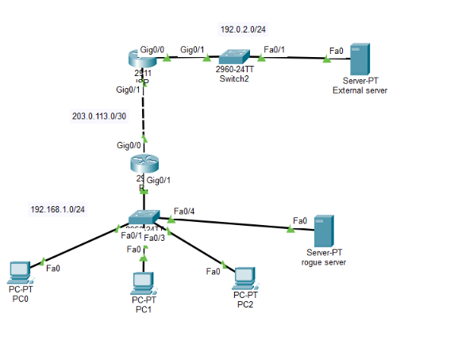

```text
                         External Network
                           192.0.2.0/24
                                |
                           External SW
                                |
                         External Server
                                |
                           ISP Router
                                |
                         203.0.113.0/30
                                |
                               R1
                    Legitimate DHCP server
                       192.168.1.1/24
                                |
                          VLAN 10 access
                                |
                               SW1
                    Layer 2 security controls
                  /         |          |        \
               PC0         PC1        PC2    Rogue DHCP
             Fa0/1       Fa0/2      Fa0/3      Fa0/4
```

### Interface roles

| Interface | Connected device | VLAN | DHCP snooping | DAI |
|---|---|---|---|---|
| `Fa0/1` | PC0 | 10 | Untrusted | Untrusted |
| `Fa0/2` | PC1 | 10 | Untrusted | Untrusted |
| `Fa0/3` | PC2 | 10 | Untrusted | Untrusted |
| `Fa0/4` | Rogue DHCP server | 10 | Untrusted | Untrusted |
| `Gi0/1` | R1 (uplink) | 10 | **Trusted** | **Trusted** |

Client traffic is deliberately placed in **VLAN 10** rather than VLAN 1. VLAN 1 is the
default VLAN on every port and the default native VLAN on trunks, which makes it a poor
choice for user data in a security-focused design.

---

## Addressing

| Item | Value |
|---|---|
| Client VLAN | 10 |
| Client subnet | `192.168.1.0/24` |
| R1 gateway (VLAN 10) | `192.168.1.1/24` |
| DHCP pool start | `192.168.1.11` |
| DHCP excluded range | `192.168.1.1 – 192.168.1.10` |
| Legitimate DNS | `8.8.8.8` |

### Rogue DHCP server

Statically addressed so it does not depend on its own service, and configured to hand out
a **different gateway and DNS** so a poisoned client lease is unmistakable:

| Item | Legitimate (R1) | Rogue |
|---|---|---|
| Server address | `192.168.1.1` | `192.168.1.250` |
| Offered range starts | `192.168.1.11` | `192.168.1.100` |
| Offered gateway | `192.168.1.1` | `192.168.1.254` |
| Offered DNS | `8.8.8.8` | `1.1.1.1` |

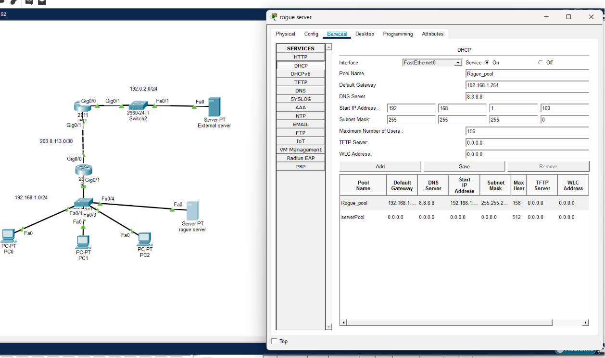

---

## Part 1 — Port Security

Restricts which MAC addresses may source traffic on an access port, mitigating MAC
flooding and casual unauthorized device connection.

### Configuration

```cisco
interface range FastEthernet0/1-3
 switchport mode access
 switchport access vlan 10
 switchport port-security
switchport port-security maximum 1
 switchport port-security mac-address sticky
 switchport port-security violation restrict
```

**Why `restrict` and not `shutdown` or `protect`:**

| Mode | Drops offending traffic | Logs / increments counter | Port stays up |
|---|---|---|---|
| `protect` | Yes | No | Yes |
| `restrict` | Yes | Yes | Yes |
| `shutdown` | Yes | Yes | No — err-disabled |

`restrict` was chosen so the violation is visible and countable without taking the port
down. `shutdown` is the stricter production default, but recovery requires either manual
`shutdown` / `no shutdown` or `errdisable recovery cause psecure-violation`.

### Saving sticky addresses

Sticky MAC addresses are written to the **running** configuration only. Without saving,
they are lost on reload and the switch relearns whatever device is plugged in — silently
defeating the control:

```cisco
copy running-config startup-config
```

### Verification

```cisco
show port-security
show port-security interface fa0/1
show port-security address
```

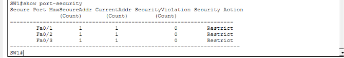
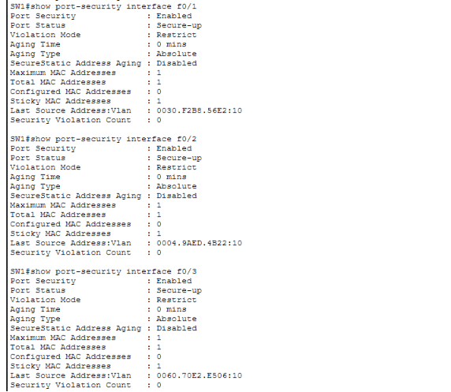
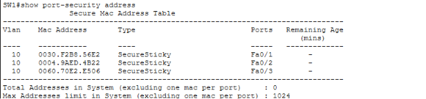

Confirmed state: Port Security enabled, Port Status `Secure-up`, Maximum MAC Addresses 1,
Sticky MAC Addresses 1, Violation Mode `Restrict`.

### Violation test

**Method:** "changed PC0's MAC address in Config > FastEthernet0 to  0030.F2B8.56E6   while it remained connected 
 to Fa0/1" 

**Before — violation counter at 0:**

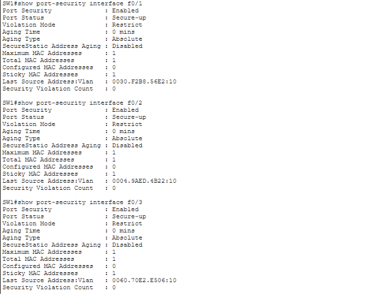

**After — unauthorized MAC introduced violation counter is now at 1:**

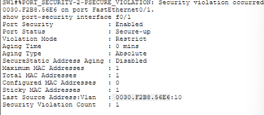


| Condition | Result |
|---|---|
| Authorized (sticky-learned) MAC | Forwarded |
| Unauthorized MAC | Dropped |
| Interface state | Remains up |
| Violation counter | Increments |

---

## Part 2 — DHCP Snooping

Filters DHCP server messages arriving on untrusted ports, and builds the binding database
that Dynamic ARP Inspection depends on.

### Attack first — unprotected behavior

With DHCP snooping disabled, the rogue server was brought online and a client renewed:

```text
ipconfig /release
ipconfig /renew
```

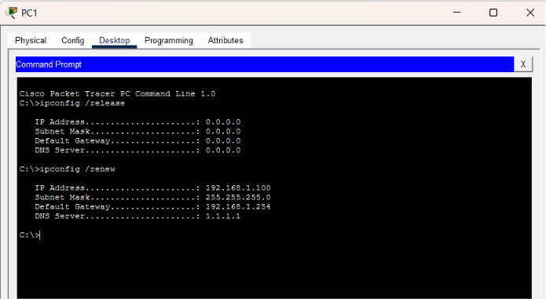


IP Address:       192.168.1.100
Subnet Mask:      255.255.255.0
Default Gateway:  192.168.1.254   <-- rogue
DNS Server:       1.1.1.1         <-- rogue


The client accepted the rogue lease. Its default gateway now points at an attacker-
controlled address — the setup for an on-path (man-in-the-middle) attack, since all
off-subnet traffic is handed to the rogue.

### Configuration

```cisco
ip dhcp snooping
ip dhcp snooping vlan 10

interface GigabitEthernet0/1
 ip dhcp snooping trust
```

Only the uplink toward R1 is trusted. All access ports — including `Fa0/4`, where the
rogue server sits — stay untrusted, so DHCP OFFER and ACK messages arriving on them are
dropped.

### After — protected behavior

Same rogue server, same renewal, snooping enabled:

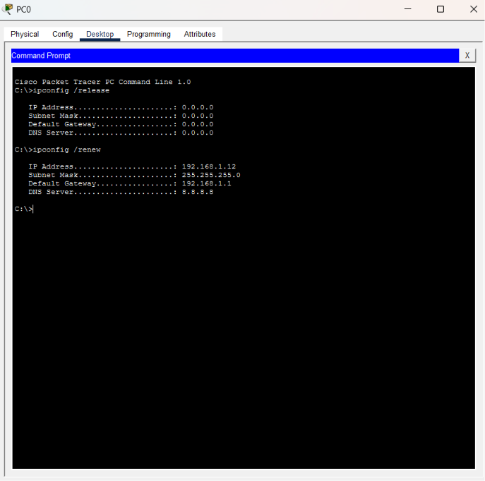


### Verification

```cisco
show ip dhcp snooping
show ip dhcp snooping binding
```

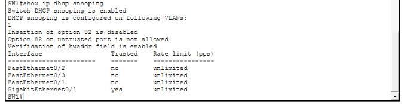
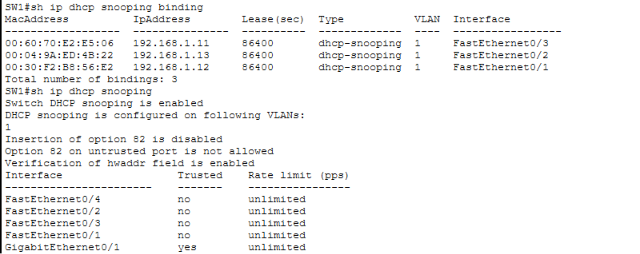


Note that the rogue server never appears in this table. It is statically addressed, so it
never completes a DHCP exchange the switch can observe — which becomes important in Part 3.

### Simulation-mode capture

Packet Tracer's simulation mode was used to observe the rogue OFFER being discarded.

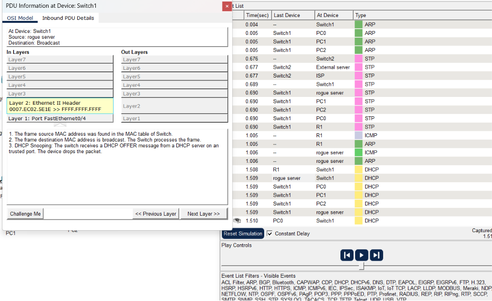

> **Note on simulation accuracy:** the Packet Tracer event description in this capture uses
> trust wording that does not precisely match the configured interface trust boundary. The
> switch configuration and `show ip dhcp snooping` output are the authoritative evidence
> here; the simulation trace is supporting context only.


## Part 3 — Dynamic ARP Inspection

Validates ARP packets on untrusted ports against the DHCP snooping binding table, dropping
those whose IP-to-MAC mapping cannot be verified. This is the control that stops ARP
poisoning.

### Configuration

```cisco
ip arp inspection vlan 10

interface GigabitEthernet0/1
 ip arp inspection trust
```

**The uplink trust statement is not optional.** DAI treats every interface as untrusted by
default and validates against the snooping bindings. R1 is statically addressed, so it has
no binding entry — leaving `Gi0/1` untrusted causes DAI to drop R1's ARP replies, and every
client loses its default gateway. This is the single most common way this configuration is
broken.

### Why the rogue server fails DAI

The rogue at `192.168.1.250` is statically addressed and has no DHCP snooping
binding. It sits on an untrusted access port, so on production hardware any ARP it
sources — including the gratuitous ARP an attacker would use to claim the gateway
address — cannot be validated and is dropped.

> **Simulator limitation:** Packet Tracer accepts the DAI configuration and reports
> VLAN 10 as Enabled/Active with all three validations on, but does not enforce ARP
> validation in the data path. All counters (Forwarded, Dropped, DHCP Drops, ACL
> Drops) remain at zero, and the rogue server can still reach clients. This was
> confirmed after clearing ARP caches on all hosts and resetting the inspection
> statistics. The configuration and interface trust states are therefore the
> evidence for this section; a live drop capture would require CML, GNS3 or EVE-NG
> with real IOS images.


### Verification

```cisco
show ip arp inspection
show ip arp inspection interfaces
```

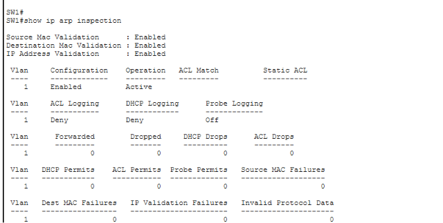
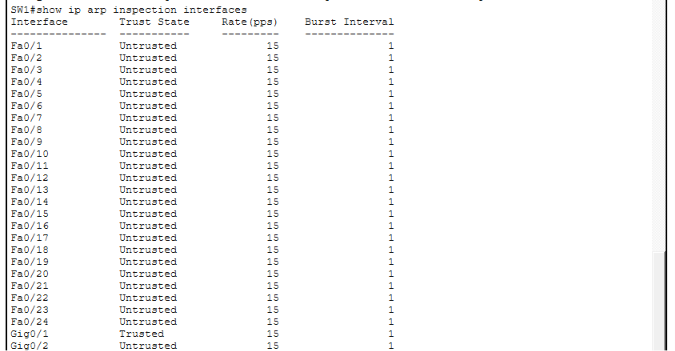


---

## Part 4 — Additional Access-Layer Hardening

Port security, snooping and DAI address MAC spoofing, rogue DHCP and ARP poisoning. Two
common Layer 2 attacks remain: STP manipulation and VLAN hopping.

```cisco
! Access ports: forward immediately, and never accept a BPDU
interface range FastEthernet0/1-4
 spanning-tree portfast
 spanning-tree bpduguard enable
 switchport nonegotiate

! Unused ports: shut and parked in an unused VLAN
interface range FastEthernet0/5-24
 switchport mode access
 switchport access vlan 999
 shutdown
interface g0/2
 switchport mode access
 switchport access vlan 999
 shutdown
```

| Command | Attack mitigated |
|---|---|
| `spanning-tree bpduguard enable` | STP root-bridge takeover from an access port |
| `switchport nonegotiate` | DTP-based switch spoofing / VLAN hopping |
| Unused ports shut into VLAN 999 | Unauthorized physical connection |

---

## How the Controls Depend on Each Other

```text
Port Security
      │  restricts which MAC addresses may source traffic
      ▼
DHCP Snooping
      │  filters rogue DHCP servers on untrusted ports
      │  and builds the IP-to-MAC binding table
      ▼
Dynamic ARP Inspection
      │  validates ARP against those bindings
      ▼
   Trusted access layer
```

The ordering is a real dependency, not a presentation choice. DAI has nothing to validate
against unless DHCP snooping has populated bindings first, which is why enabling DAI alone
on a network of static hosts breaks connectivity rather than securing it.

---

## Verification Command Reference

```cisco
show port-security
show port-security interface fa0/1
show port-security address
show mac address-table
show ip dhcp snooping
show ip dhcp snooping binding
show ip arp inspection
show ip arp inspection interfaces
show vlan brief
```


---

## Notes on Real-World Behavior

Packet Tracer simplifies several behaviors that matter on production hardware:

- **DHCP Option 82.** On real IOS, enabling DHCP snooping causes the switch to insert
  Option 82 (relay agent information) into client DHCP packets. A router acting as a DHCP
  server drops those packets by default because the giaddr is `0.0.0.0`, which presents as
  "DHCP stopped working the moment I enabled snooping." The fix is
  `no ip dhcp snooping information option` on the switch, or
  `ip dhcp relay information trust-all` on the server.
- **DAI rate limiting.** Untrusted ports default to 15 ARP packets per second; exceeding it
  err-disables the port. Trusted ports are unlimited. Packet Tracer does not enforce this.
- **ARP ACLs.** Statically addressed hosts on untrusted ports need an `arp access-list`
  mapped with `ip arp inspection filter`, since they will never have a snooping binding.
  Packet Tracer's support for this is limited, so the trusted-uplink approach was used here.

---


## What I Took Away From This Lab

The troubleshooting taught me more than the configuration. After enabling DHCP
snooping, every client dropped to an APIPA address and lost the gateway. The
obvious suspects were the trust state and Option 82, but `show ip dhcp snooping`
ruled both out — Gi0/1 was trusted and Option 82 insertion was already disabled.
The actual cause was visible in `ipconfig /all`: clients were still holding a DHCP
server address from the pre-migration subnet, and the uplink had not been moved
into the client VLAN with the access ports. Snooping was working correctly on a
VLAN that had no gateway in it.

The second lesson was that sticky MAC addresses only persist if the configuration
is saved, which makes the control look correct in `show` output while being one
reload away from doing nothing.

The third was that DAI has no independent source of truth. It validates only
against the DHCP snooping bindings, which is why a statically addressed gateway
needs an explicitly trusted uplink and why enabling DAI on a network of static
hosts breaks connectivity rather than securing it.

---

## Project File

`layer2-security.pkt`
