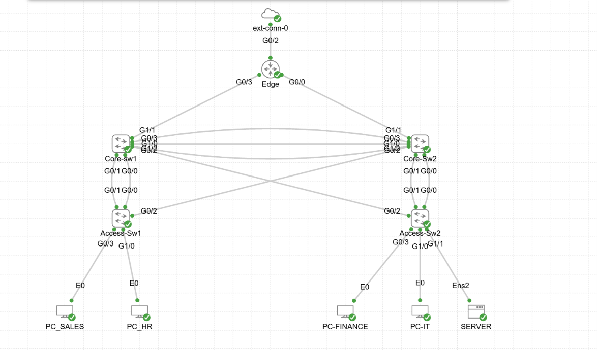
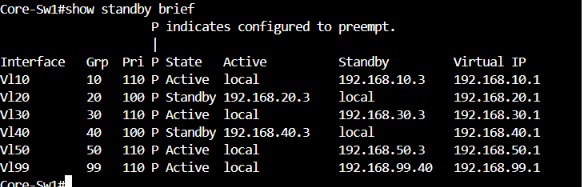
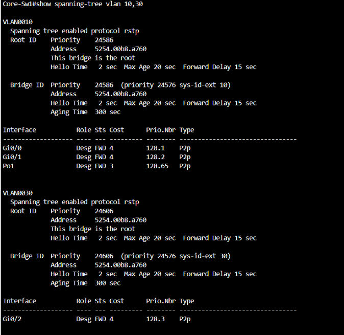
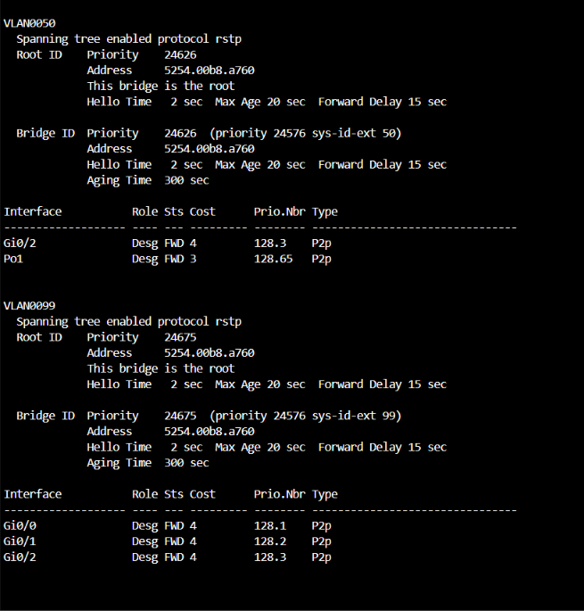
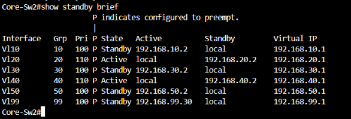
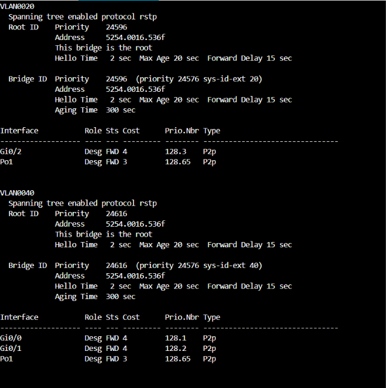
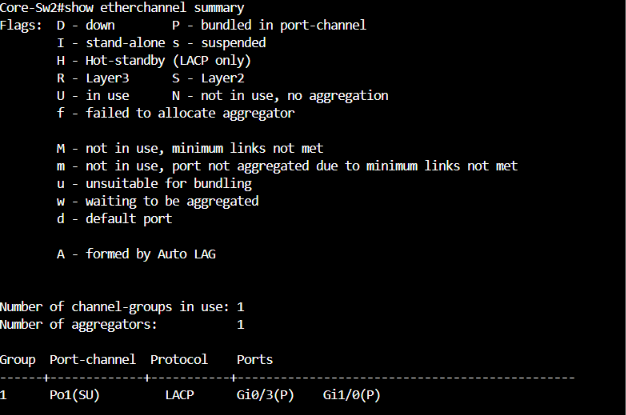
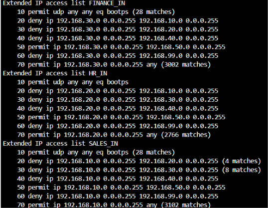
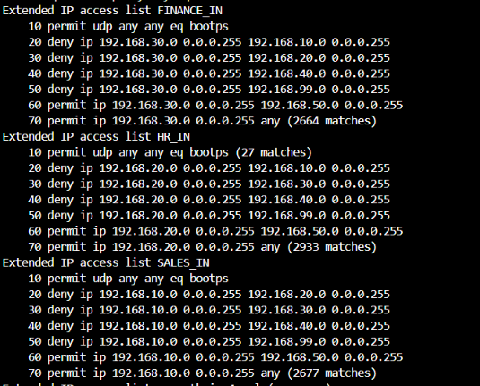
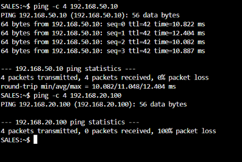

# Enterprise Capstone Lab

A dual-core, multi-VLAN enterprise network built in Cisco Modeling Labs (CML), combining routing, switching, redundancy, and security into a single design. This project pulls together everything from the earlier labs in this repo (VLANs, inter-VLAN routing, OSPF, NAT/PAT, ACLs, DHCP snooping, DAI, port security) into one cohesive topology.

## Topology

```
                         ext-conn-0 (ISP )
                              |
                            EDGE-R
                         /          \
                  10.0.2.0/30      10.0.3.0/30
                     /                    \
               Core-Sw1 ======LACP====== Core-Sw2
               (Po1, all VLANs)      (10.0.1.0/30 routed link between cores)
                /        \          /        \
        Access-Sw1        \        /       Access-Sw2
        (Sales, HR)         \    /      (Finance, IT, Server)
```

Core-Sw1 and Core-Sw2 are cross-connected to *both* access switches for L2 redundancy, with a dedicated routed point-to-point link between the cores for OSPF, kept separate from the LACP trunk that extends VLANs for HSRP peering.

## Objectives

- Design a collapsed-core enterprise network with no single point of failure at the distribution/core layer
- Align the Layer 2 (STP) and Layer 3 (HSRP) active paths per VLAN to avoid suboptimal traffic flow
- Segment departments at Layer 3 using per-VLAN ACLs rather than relying on VLANs alone
- Harden the access edge against common L2 attacks (rogue DHCP, ARP spoofing, MAC flooding, accidental loops)
- Centralize DHCP and restrict management access to a single trusted subnet

## IP Addressing

| Segment | Network |
|---|---|
| Sales (VLAN 10) | 192.168.10.0/24 |
| HR (VLAN 20) | 192.168.20.0/24 |
| Finance (VLAN 30) | 192.168.30.0/24 |
| IT (VLAN 40) | 192.168.40.0/24 |
| Server (VLAN 50) | 192.168.50.0/24 |
| Management (VLAN 99) | 192.168.99.0/24 |
| Native/unused VLAN | 999 |
| Edge – Core-Sw1 | 10.0.2.0/30 |
| Edge – Core-Sw2 | 10.0.3.0/30 |
| Core-Sw1 – Core-Sw2 | 10.0.1.0/30 |
| Loopbacks | 172.16.2.0/24 (per device) |

## Key Design Decisions

- **HSRP active / STP root alignment per VLAN** — Core-Sw1 is both HSRP active gateway and STP root for VLANs 10, 30, 50, 99; Core-Sw2 for VLANs 20, 40. Keeps the L2 forwarding path and L3 gateway on the same switch, avoiding unnecessary hops across the core-core link.
- **LACP EtherChannel between cores** carries all VLANs so HSRP peers can see each other, kept separate from the routed `/30` link used for OSPF.
- **Non-default native VLAN (999)** on every trunk, with VLAN 1 shut down on the access switches, to mitigate VLAN-hopping via double-tagging.
- **Centralized DHCP** via `ip helper-address` relay from each core SVI to a server on the Server VLAN.
- **Access-layer security**: DHCP snooping, Dynamic ARP Inspection, and sticky port security (violation restrict) on all host-facing ports, plus PortFast + BPDU Guard so those ports come up fast and shut down automatically if a BPDU appears (e.g., a rogue switch plugged into a host port).
- **Management plane locked down**: SSH-only, VTY access restricted to the IT subnet via an access-class ACL.

## Security Segmentation (ACLs)

Per-VLAN ACLs applied inbound on the Sales, HR, and Finance SVIs enforce:
- No direct access between Sales, HR, Finance, or into IT
- All three can reach the Server VLAN
- None of the three can reach the Management VLAN
- IT is left unrestricted (assumed to need broad access)

These ACLs are applied identically on **both** core switches — since either core can be the active HSRP gateway at any given time, the security policy has to hold regardless of which one is forwarding.

## Issues Found & Fixed

**Inconsistent ACLs across the two cores.** During review, the ACLs on Core-Sw1 and Core-Sw2 were found to differ for the same VLANs — one core denied Sales/HR access to the Server subnet while the other permitted it, and Finance's access to the Management VLAN was inconsistent between the two. Because HSRP determines which core is actively forwarding for a given VLAN, this meant the effective security policy silently changed on failover. Fixed by standardizing the ACL logic across both switches and verifying with `show access-lists` match counters on each.

**SSH access to the access switches broke with `ip routing` enabled.** Access-Sw1 and Access-Sw2 are Layer 2-only devices in this design and rely on `ip default-gateway` to reach the management subnet — a mechanism that only works when IP routing is disabled on the switch. With `ip routing` enabled, that path stopped working and SSH access failed. Fixed by explicitly configuring `no ip routing` on both access switches.

## Known Limitations

- **OSPF authentication uses plaintext (simple) auth**, not MD5/SHA. This was a deliberate choice to demonstrate the configuration; a production design would use MD5 or a SHA key-chain instead.


## Verification


**Topology**


**HSRP + STP root alignment** — Core-Sw1 active/root for VLANs 10, 30, 50, 99:






Core-Sw2 active/root for VLANs 20, 40:





**EtherChannel status (Po1, LACP)**



**ACL enforcement (match counters, both cores)**





**Segmentation proof** — Sales → Server succeeds, Sales → HR blocked:



**OSPF neighbor adjacency**


**DHCP snooping bindings and port security**


## Repo Contents

- `capstone_enterprise_lab_redacted.yaml` — full CML topology export (enable secrets, username hashes, and the OSPF authentication key have been redacted before publishing)

## Tools

Built and verified in Cisco Modeling Labs (Personal), using Wireshark for packet-level verification and a structured OSI-model troubleshooting approach throughout.


