# Enterprise Capstone Lab

A dual-core, multi-VLAN enterprise network built in Cisco Modeling Labs (CML), combining routing, switching, redundancy, and security into a single design. This project pulls together everything from the earlier labs in this repo (VLANs, inter-VLAN routing, OSPF, NAT/PAT, ACLs, DHCP snooping, DAI, port security) into one cohesive topology, then extends it with a monitoring and operations layer: LibreNMS monitoring and alerting, centralized syslog, NTP, and a documented HSRP failover test.

## Project Phases

| Phase | Scope |
|---|---|
| **1. Network build** | Collapsed-core design, HSRP/STP alignment, LACP, OSPF, NAT/PAT, centralized DHCP, per-VLAN ACLs, access-layer security |
| **2. Monitoring and operations** | LibreNMS monitoring and alerting, centralized syslog, NTP, and a controlled HSRP failover test — see [Phase 2](#phase-2-monitoring-and-operations) and the [failover test write-up](hsrp-failover-test.md) |

## Topology

```
                         ext-conn-0 (ISP )
                              |
                            EDGE-R
                         /          \
                  10.0.2.0/30      10.0.3.0/30
                     /                    \
               Core-Sw1 ======LACP====== Core-Sw2
               (Po1, all VLANs)      (10.0.1.0/30 routed link between cores)
                /        \          /        \
        Access-Sw1        \        /       Access-Sw2
        (Sales, HR)         \    /      (Finance, IT, Server)
```

Core-Sw1 and Core-Sw2 are cross-connected to *both* access switches for L2 redundancy, with a dedicated routed point-to-point link between the cores for OSPF, kept separate from the LACP trunk that extends VLANs for HSRP peering.

Phase 2 adds an Ubuntu Server node on the Server VLAN (192.168.50.10) that hosts the monitoring stack.

## Objectives

**Phase 1: Network build**

- Design a collapsed-core enterprise network with no single point of failure at the distribution/core layer
- Align the Layer 2 (STP) and Layer 3 (HSRP) active paths per VLAN to avoid suboptimal traffic flow
- Segment departments at Layer 3 using per-VLAN ACLs rather than relying on VLANs alone
- Harden the access edge against common L2 attacks (rogue DHCP, ARP spoofing, MAC flooding, accidental loops)
- Centralize DHCP and restrict management access to a single trusted subnet

**Phase 2: Monitoring and operations**

- Monitor every network device from a central NMS, including health sensors and HSRP state
- Centralize device logging and give the lab a single time source
- Alert on loss of gateway redundancy, and prove the alerting with a controlled failover test

## IP Addressing

| Segment | Network |
|---|---|
| Sales (VLAN 10) | 192.168.10.0/24 |
| HR (VLAN 20) | 192.168.20.0/24 |
| Finance (VLAN 30) | 192.168.30.0/24 |
| IT (VLAN 40) | 192.168.40.0/24 |
| Server (VLAN 50) | 192.168.50.0/24 |
| Management (VLAN 99) | 192.168.99.0/24 |
| Native/unused VLAN | 999 |
| Edge – Core-Sw1 | 10.0.2.0/30 |
| Edge – Core-Sw2 | 10.0.3.0/30 |
| Core-Sw1 – Core-Sw2 | 10.0.1.0/30 |
| Loopbacks | 172.16.2.0/24 (per device) |
| Monitoring server (Phase 2) | 192.168.50.10 (Server VLAN) |

## Key Design Decisions

- **HSRP active / STP root alignment per VLAN** — Core-Sw1 is both HSRP active gateway and STP root for VLANs 10, 30, 50, 99; Core-Sw2 for VLANs 20, 40. Keeps the L2 forwarding path and L3 gateway on the same switch, avoiding unnecessary hops across the core-core link.
- **LACP EtherChannel between cores** carries all VLANs so HSRP peers can see each other, kept separate from the routed `/30` link used for OSPF.
- **Non-default native VLAN (999)** on every trunk, with VLAN 1 shut down on the access switches, to mitigate VLAN-hopping via double-tagging.
- **Centralized DHCP** via `ip helper-address` relay from each core SVI to a server on the Server VLAN.
- **Access-layer security**: DHCP snooping, Dynamic ARP Inspection, and sticky port security (violation restrict) on all host-facing ports, plus PortFast + BPDU Guard so those ports come up fast and shut down automatically if a BPDU appears (e.g., a rogue switch plugged into a host port).
- **Management plane locked down**: SSH-only, VTY access restricted to the IT subnet via an access-class ACL.

## Security Segmentation (ACLs)

Per-VLAN ACLs applied inbound on the Sales, HR, and Finance SVIs enforce:
- No direct access between Sales, HR, Finance, or into IT
- All three can reach the Server VLAN
- None of the three can reach the Management VLAN
- IT is left unrestricted (assumed to need broad access)

These ACLs are applied identically on **both** core switches — since either core can be the active HSRP gateway at any given time, the security policy has to hold regardless of which one is forwarding.

## Phase 2: Monitoring and Operations

Phase 1 built the network; Phase 2 adds the tooling to observe it and to prove that its redundancy works. A single Ubuntu Server node on the Server VLAN (192.168.50.10) runs:

- **LibreNMS** — SNMP polling of all five network devices (interfaces, health sensors, HSRP state) and alerting
- **rsyslog** — central collection of device logs, viewed on the LibreNMS Syslog page
- **chrony** — NTP server for the lab, synced to public NTP servers

### Monitored devices

| Device | Polled address |
|---|---|
| EDGE-R | 172.16.2.3 (loopback) |
| Core-Sw1 | 192.168.50.2 (Server VLAN) |
| Core-Sw2 | 192.168.50.3 (Server VLAN) |
| Access-Sw1 | 192.168.99.10 (Management VLAN) |
| Access-Sw2 | 192.168.99.50 (Management VLAN) |

Devices are polled over SNMPv2c. Each device's SNMP location names its place in the topology (for example `CML-Lab-Core-SW1`), so the LibreNMS device list maps directly onto the design.

### Alerting on redundancy, not just reachability

If one core loses an HSRP group, the other core takes over and every device stays up, so reachability checks show nothing wrong — yet that VLAN is now running without a backup gateway. A custom LibreNMS rule watches HSRP state instead:

- **Rule:** HSRP group not Active/Standby — critical, recovery alerts on, scoped to both cores
- **Conditions (all must match):** `sensors.sensor_class` equals `state`, `sensors.sensor_descr` contains `Hsrp`, `sensors.sensor_current` less than `5`

HSRP states are reported numerically (1 initial, 2 learn, 3 listen, 4 speak, 5 standby, 6 active), so any value below 5 means a group is not in a steady state.

### Syslog and NTP

The network devices send their logs to the server, so HSRP state changes (`%HSRP-5-STATECHANGE`) and interface events land in one place. rsyslog stamps each message with the server's receive time, which keeps the LibreNMS event timeline in order even though the device clocks drift (see [Known Limitations](#known-limitations)).

chrony on the same server keeps accurate time against public NTP servers and serves it to the lab, with the network devices configured as its NTP clients.

### HSRP failover test

Core-Sw1's Vlan10 SVI, the active gateway for VLAN 10, was shut down and then restored:

- Core-Sw2 took over VLAN 10 in about 8 seconds, consistent with HSRP's default 10-second hold time.
- The alert fired on Core-Sw1's VLAN 10 sensor (state `initial`), and syslog recorded the state changes on both cores.
- After `no shutdown`, Core-Sw1 preempted back to Active within about 5 seconds and the alert cleared.
- Every other VLAN kept its normal active/standby roles.

Full method, timeline and evidence: [HSRP failover test](hsrp-failover-test.md).

## Issues Found & Fixed

### Phase 1: Network build

**Inconsistent ACLs across the two cores.** During review, the ACLs on Core-Sw1 and Core-Sw2 were found to differ for the same VLANs — one core denied Sales/HR access to the Server subnet while the other permitted it, and Finance's access to the Management VLAN was inconsistent between the two. Because HSRP determines which core is actively forwarding for a given VLAN, this meant the effective security policy silently changed on failover. Fixed by standardizing the ACL logic across both switches and verifying with `show access-lists` match counters on each.

**SSH access to the access switches broke with `ip routing` enabled.** Access-Sw1 and Access-Sw2 are Layer 2-only devices in this design and rely on `ip default-gateway` to reach the management subnet — a mechanism that only works when IP routing is disabled on the switch. With `ip routing` enabled, that path stopped working and SSH access failed. Fixed by explicitly configuring `no ip routing` on both access switches.

### Phase 2: Monitoring

**NTP server clock almost a day behind.** The devices marked the NTP server `insane`. The first cause was the server itself: `chronyc tracking` showed its clock about 82,000 seconds (roughly 23 hours) behind its upstream servers, most likely after the lab VM had been suspended, and chrony was slewing the error away gradually instead of stepping it. Stepping the clock with `chronyc makestep` cut the offset to a few milliseconds. The remaining drift on the devices themselves is covered under Known Limitations.

**Phantom HSRP sensors holding an alert open.** LibreNMS discovered three HSRP state sensors labelled `0.0.0.0` and stuck in `initial`. They matched the HSRP alert rule, so the alert could never clear, and they survived rediscovery, so the switches were still reporting them. Walking the CISCO-HSRP-MIB and decoding its `ifIndex.group` index against `show snmp mib ifmib ifindex` identified two of them as HSRP group 0 on Core-Sw1's Vlan30 and Vlan50 interfaces, with the third on Core-Sw2. Group 0 is not part of the design, and `show standby brief` listed only the six configured groups, so the switch's SNMP view and CLI view disagreed. Once these sensors no longer matched the rule, it fired and cleared correctly for the real groups.

## Known Limitations

- **OSPF authentication uses plaintext (simple) auth**, not MD5/SHA. This was a deliberate choice to demonstrate the configuration; a production design would use MD5 or a SHA key-chain instead.
- **Device clocks drift faster than NTP can correct.** With the server fixed, the emulated IOS nodes still reach it (reach 377), but their virtual clocks drift by seconds per minute — far beyond the roughly 0.05% (500 ppm) NTP can correct — so they cannot hold a stable synchronized state. Raising `ntp maxdistance` only hid the problem and was removed, and reducing memory pressure on the 16 GB host laptop did not fix it. Timestamps inside device log messages can therefore be several seconds off, but LibreNMS orders events by the server's receive time (rsyslog `timegenerated`), so the event timeline stays reliable.
- **Alert latency.** State-sensor alerts depend on the 5-minute polling cycle plus the alert job, so detection can take several minutes. Polls were forced during the failover test; syslog is the faster, event-driven signal.
- **SNMPv2c polling.** Community-based SNMPv2c is used in the lab; a production design would use SNMPv3 with authentication and encryption.

## Verification

### Phase 1: Network build

**Topology**
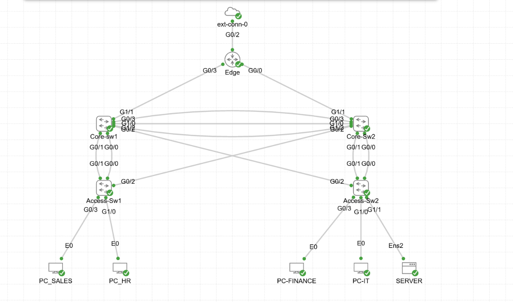

**HSRP + STP root alignment** — Core-Sw1 active/root for VLANs 10, 30, 50, 99:
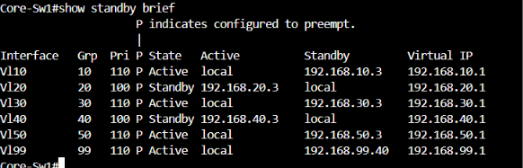

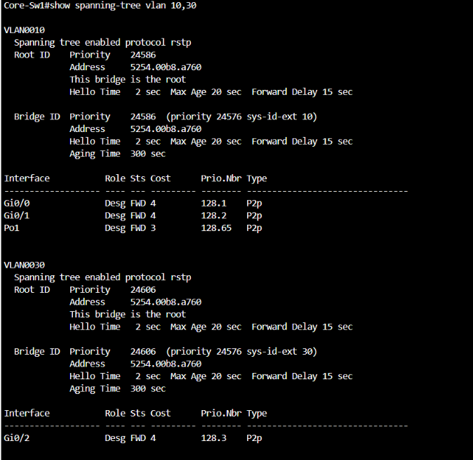

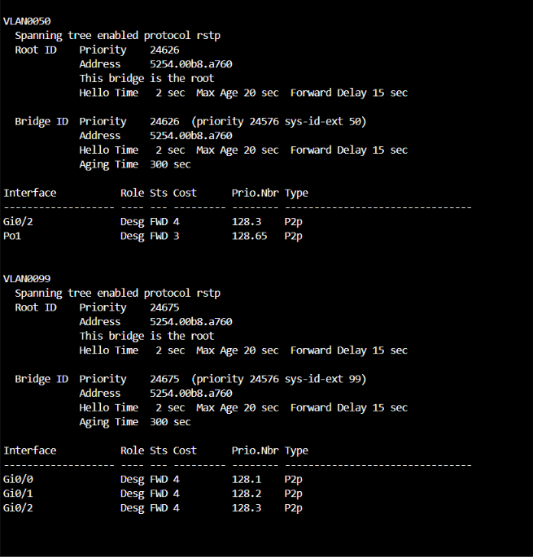

Core-Sw2 active/root for VLANs 20, 40:

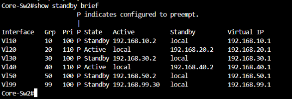

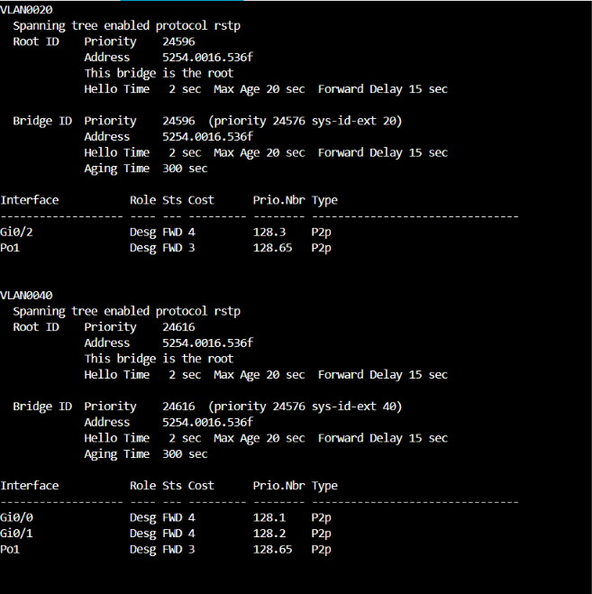

**EtherChannel status (Po1, LACP)**

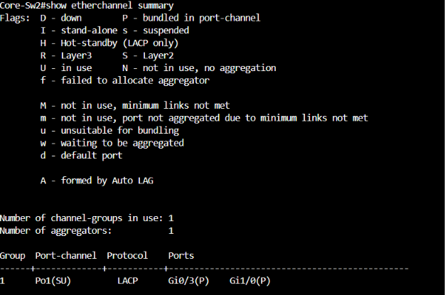

**ACL enforcement (match counters, both cores)**

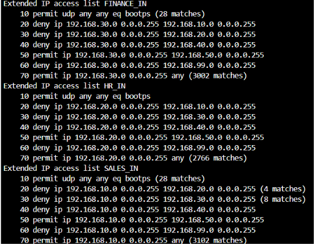

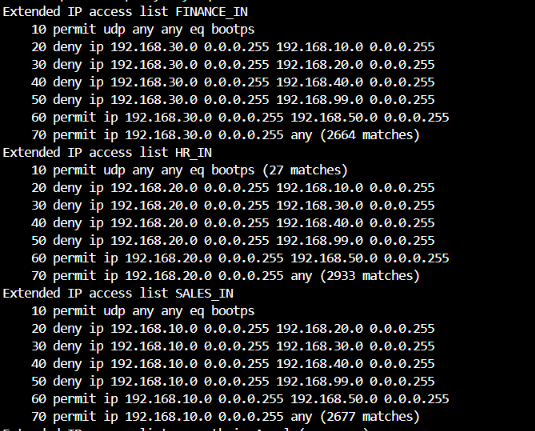

**Segmentation proof** — Sales → Server succeeds, Sales → HR blocked:

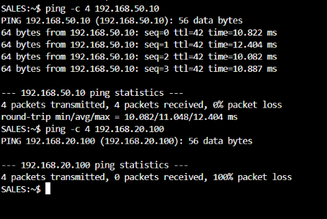

**OSPF neighbor adjacency**

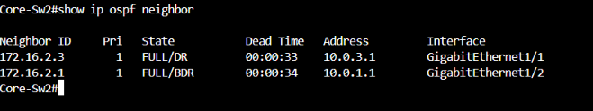

**DHCP snooping bindings and port security**

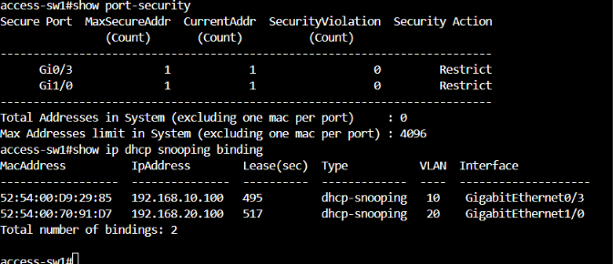

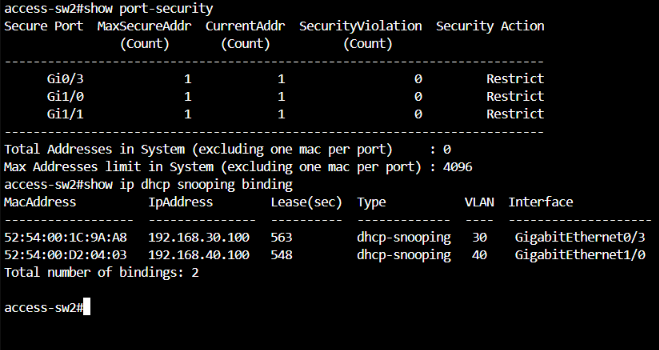

### Phase 2: Monitoring and alerting

**LibreNMS device inventory** — all five devices discovered and polled:

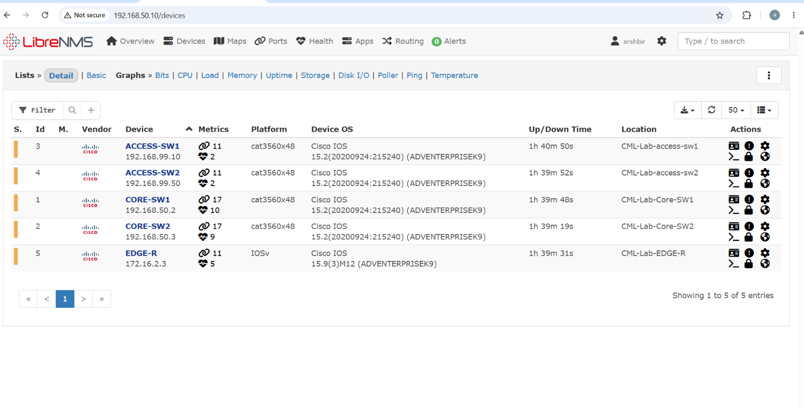

**HSRP failover seen by the monitoring layer** — syslog state changes on both cores, and the alert firing on Core-Sw1 and clearing after recovery (full test in [hsrp-failover-test.md](hsrp-failover-test.md)):


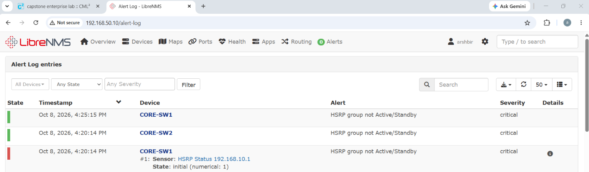

## Repo Contents

- `capstone_enterprise_lab_redacted.yaml` — full CML topology export, including the monitoring server (enable secrets, username hashes, the OSPF authentication key, the SNMP community string, and the server's login password have been redacted before publishing)
- `hsrp-failover-test.md` — Phase 2 HSRP failover test: method, timeline and evidence
- `screenshots/` — verification captures for both phases

## Tools

Built and verified in Cisco Modeling Labs (Personal) running on VMware Workstation, with a structured OSI-model troubleshooting approach throughout. Phase 2 adds LibreNMS, rsyslog and chrony on Ubuntu Server, with Net-SNMP (`snmpwalk`) and direct MariaDB queries used to troubleshoot the monitoring layer.
