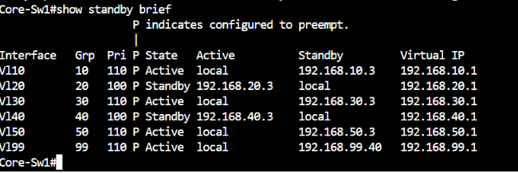
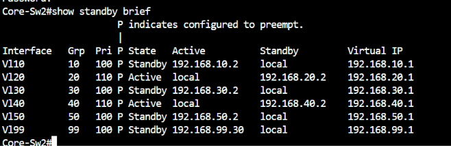
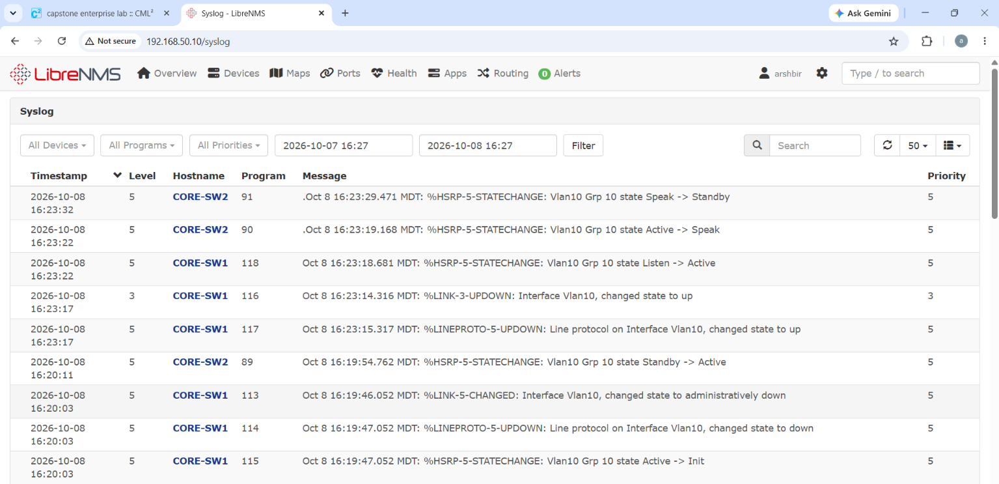

# HSRP Failover Test with LibreNMS Alerting

Part of Phase 2 of the [Enterprise Capstone Lab](./07-enterprise-lab).

## Objective

Show that the dual-core HSRP design fails over correctly for a single VLAN, and that the monitoring layer (SNMP polling, syslog, and an alert rule) detects the failure and its recovery.

## Design under test

Core-Sw1 and Core-Sw2 run HSRP with preempt on every VLAN SVI. Active roles are split per VLAN so both cores carry traffic:

| Core | Active for | Standby for |
|---|---|---|
| Core-Sw1 (priority 110) | VLAN 10, 30, 50, 99 | VLAN 20, 40 |
| Core-Sw2 (priority 110 on its own VLANs) | VLAN 20, 40 | VLAN 10, 30, 50, 99 |

The test targets **VLAN 10** (group 10, virtual IP 192.168.10.1), where Core-Sw1 is Active and Core-Sw2 is Standby. VLANs 50 and 99 were avoided because they carry the management path to the LibreNMS server.

## Alert rule

LibreNMS rule **HSRP group not Active/Standby**, severity Critical, recovery alerts on, scoped to both cores (192.168.50.2 and 192.168.50.3):

- `sensors.sensor_class` equals `state`
- `sensors.sensor_descr` contains `Hsrp`
- `sensors.sensor_current` less than `5`

HSRP states are reported numerically (1 initial, 2 learn, 3 listen, 4 speak, 5 standby, 6 active), so any value below 5 means the group is not in a healthy steady state.

## Method

1. Capture `show standby brief` on both cores (baseline).
2. On Core-Sw1: `interface vlan 10`, then `shutdown`.
3. Capture `show standby brief` on both cores (failure state).
4. Force a poll of both cores and an alert evaluation, since the default 5-minute polling cycle would delay the demo:
   ```
   cd /opt/librenms
   sudo -u librenms ./poller.php -h core-sw1
   sudo -u librenms ./poller.php -h core-sw2
   sudo -u librenms ./alerts.php
   ```
5. On Core-Sw1: `no shutdown`, wait for preempt, then force the same polls and alert run again.
6. Review the LibreNMS Syslog and Alert Log pages.

## Results

**HSRP state for VLAN 10**

| Phase | Core-Sw1 | Core-Sw2 |
|---|---|---|
| Baseline | Active (pri 110) | Standby |
| Vlan10 shut on Core-Sw1 | Init, peers unknown | Active, standby unknown |
| After `no shutdown` | Active (preempt) | Standby |

All other groups were unaffected during the failure: Core-Sw1 stayed Active for VLANs 30, 50 and 99, and Core-Sw2 stayed Active for VLANs 20 and 40. The failure was contained to the VLAN under test.

**Event timeline** (times are when the LibreNMS server received each syslog message, 2026-10-08)

| Time | Event |
|---|---|
| 16:20:03 | Core-Sw1: Vlan10 administratively down, line protocol down, HSRP Grp 10 Active -> Init |
| 16:20:11 | Core-Sw2: HSRP Grp 10 Standby -> Active |
| 16:20:14 | LibreNMS alert fires: Core-Sw1 sensor `HSRP Status 192.168.10.1`, state initial (1) |
| 16:23:17 | Core-Sw1: Vlan10 link and line protocol up |
| 16:23:22 | Core-Sw1: Grp 10 Listen -> Active (preempt); Core-Sw2: Active -> Speak |
| 16:23:32 | Core-Sw2: Grp 10 Speak -> Standby |
| 16:25:15 | LibreNMS alert for Core-Sw1 recovers |

- **Failover time:** about 8 seconds from Core-Sw1 leaving Active to Core-Sw2 taking over.
- **Recovery time:** about 5 seconds from the SVI coming back up to Core-Sw1 being Active again, and about 10 more for Core-Sw2 to settle into Standby.
- **Alerting:** the alert fired within seconds of the forced poll and cleared after the recovery poll. An earlier transient alert on Core-Sw2 (group caught in `speak` during a quick SVI bounce at 16:15) cleared in the same alert run. The alert badge returned to 0.

## Observations

- A state-sensor alert only sees what the poller sees. With the default 5-minute poll and the alert job on top of that, detection can take up to about 10 minutes, so polls were forced for this test. Syslog entries are event-driven and recorded the failover instantly.
- A normal failover or preempt passes briefly through `listen` and `speak`. A poll that lands in that window raises a short alert that clears on the next poll. This is expected behaviour of the rule, not a fault.
- The syslog timeline above comes from the server's clock. See the limitation below.

## Limitation: device clocks

The CML-emulated IOS nodes cannot hold an accurate clock. Chrony on the Ubuntu node serves time to the lab, but the devices' virtual clocks drift faster than NTP can correct, so the timestamps embedded in device log messages differ from real time by a few seconds. LibreNMS orders events using the time the server received each message (rsyslog `timegenerated`), so the event ordering above is reliable even though individual device timestamps are approximate.

## Evidence

**Normal state** — `show standby brief` on both cores, all groups in their designed roles:





**During the failure** — Vlan10 shut on Core-Sw1, Core-Sw2 Active for VLAN 10:


**Syslog** — HSRP state changes received by LibreNMS:



**Alert log** — alert firing on Core-Sw1 and recovering:


